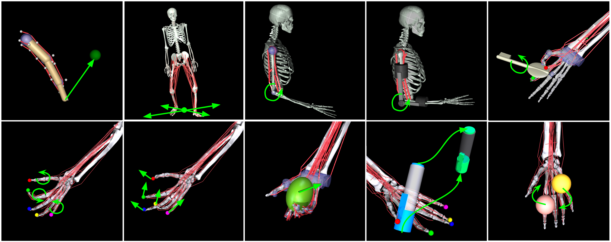

# myoSuite

[](https://myosuite.readthedocs.io/en/latest/?badge=latest)

[](https://github.com/facebookresearch/myosuite/blob/main/CONTRIBUTING.md)

`myoSuite` is a collection of musculoskeletal environments and tasks simulated with the [MuJoCo](http://www.mujoco.org/) physics engine and wrapped in the OpenAI ``gym`` API to enable the application of Machine Learning to bio-mechanic control problems

Below is an overview of the tasks in the myoSuite. Full task details are available [here], and baseline details are availale [here]



## Getting Started
You will need Python 3.7.1 or later versions. 
It is recommended to use [Miniconda](https://docs.conda.io/en/latest/miniconda.html#latest-miniconda-installer-links) and to create a separate environment with 
``` bash
conda create --name myoSuite python=3.7.1
conda activate myoSuite
```

It is possible to install `myoSuite` with:
``` bash
pip install -U myoSuite
```
for advance installation see [here](wwwTBD).

Test your installation using
``` bash
python myoSuite/tests/test_myo.py
```

You can also visualize the environments with random controls using the below command
```
$ python myosuite/utils/examine_env.py --env_name myoElbowPose1D6MRandom-v0
```
**NOTE:** If the visualization results in a GLFW error, this is because `mujoco-py` does not see some graphics drivers correctly. This can usually be fixed by explicitly loading the correct drivers before running the python script. See [this page](https://github.com/aravindr93/mjrl/tree/master/setup#known-issues) for details.

## Examples
It is possible to create and interface with myoSuite environments like any other OpenAI gym environments. For example, to use the `myoElbowPose1D6MRandom-v0` environment it is possible simply to run: [](https://colab.research.google.com/github/googlecolab/colabtools/blob/master/notebooks/colab-github-demo.ipynb)


```python
import myoSuite
import gym
env = gym.make('myoElbowPose1D6MRandom-v0')
env.reset()
for _ in range(1000):
  env.sim.render(mode='window')
  env.step(env.action_space.sample()) # take a random action
env.close()
```

## License

myoSuuite is licensed under the [Apache License](LICENSE)

## Citing myoSuite

If you use myoSuite in your publication, please cite the [arXiv paper](www) by using the following BibTeX entries.

```BibTeX
@Misc{myoSuite2022,
  author =       {Vittorio, Caggiano AND Huawei, Wang AND Guillaume, Durandau AND Massimo, Sartori AND Vikash, Kumar},
  title =        {myoSuite: A fast and contact-rich simulation suite for musculoskeletal motor control},
  howpublished = {\url{https://github.com/facebookresearch/myoSuite}},
  year =         {2022}
}
```

