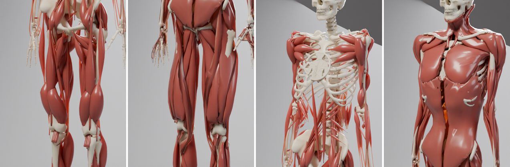

Render a rollout in Blender
===========================

``scripts/render_blender.py`` exports one CPU episode to animated USD, then
runs Blender in the background to produce a studio render and editable scene.
It accepts an explicit SB3 ``.zip`` or RSL-RL ``.pt`` checkpoint. Use ``--random``
for a demonstration with random actions; incompatible checkpoints fail instead
of falling back to random actions. Tutorial ``tutorials/3.6_Blender_Rendering.ipynb``
walks through an export, the muscle volumes and the render options.

From Python, :class:`myosuite.viz.blender_render.RenderConfig` holds the same settings
and :func:`myosuite.viz.blender_render.render_rollout` runs the export, Blender and the
video; the muscle geometry is in :mod:`myosuite.viz.muscle_tubes`.

.. code-block:: python

   from pathlib import Path
   from myosuite.viz.blender_render import RenderConfig, render_rollout

   render_rollout(RenderConfig(env="myoHandReorient8-v0", output=Path("renders/hand"),
                               seconds=1, preview=True))

.. list-table::
   :widths: 33 33 33

   * - .. image:: images/blender/leg.jpg
     - .. image:: images/blender/hand.jpg
     - .. image:: images/blender/elbow.jpg
   * - ``myoLegWalk-v0``
     - ``myoHandReorient8-v0``
     - ``myoElbowPose1D6MRandom-v0``
   * - .. image:: images/blender/tabletennis.jpg
     - .. image:: images/blender/chasetag.jpg
     -
   * - ``myoChallengeTableTennisP1-v0``
     - ``myoChallengeChaseTagP1-v0`` (``--scene mujoco``)
     -

Random-action frames rendered with Blender 5.2 at 64 samples.

.. list-table::
   :widths: 60 40

   * - .. image:: images/blender/hand_open_close.webp
     - .. image:: images/blender/leg_gait.webp
   * - ``myoHandPoseRandom-v0``, driven by a smooth flexor/extensor rhythm:
       finger flexors thicken and redden as the fist closes.
     - ``myoLegWalk-v0`` replaying the OpenSim gait of tutorial 3.5 (pelvis
       held in place). Without a policy, the muscle colour here is a visual
       proxy: a muscle shows as active while it shortens.

.. list-table::
   :widths: 60 40

   * - .. image:: images/blender/hand_paths.webp
     - .. image:: images/blender/fullbody.jpg
   * - ``--muscles paths --muscle-color activation``: MuJoCo's thin muscle paths
       with the colours of MyoSuite's MuJoCo viewer, near black at rest and red
       when active.
     - ``myoMimicFullbody-v0`` (354 muscles), a still with
       ``--muscle-color uniform``.

Animations: 2-2.4 s at 30 fps, 720x540 and 40-48 samples, rendered with Blender 5.2.

Install Blender separately and add the USD exporter dependencies to your
MyoSuite environment. The sandbox validation used MuJoCo 3.15.0 and Blender
4.5.3 LTS. Tendon tessellation uses MuJoCo's USD exporter internals, so other
versions require verification.

.. code-block:: bash

   pip install 'mujoco[usd]==3.15.0'
   # Optional policy dependencies: MyoSuite[rl] for SB3; rsl-rl-lib for RSL-RL.
   python scripts/render_blender.py \
       --env myoHandReorient8-v0 --random --seconds 1 \
       --output renders/hand --blender /path/to/blender
   python scripts/render_blender.py \
       --env myoLegWalk-v0 --checkpoint /path/to/model_1355.pt \
       --seconds 3 --output renders/walking --blender /path/to/blender

Use ``--preview`` for one frame, ``--export-only`` to export without Blender,
``--fps`` to select the video rate, and ``--resolution WIDTH HEIGHT`` for image
size, and ``--samples`` for Cycles samples per frame (default 64). Use a new
output directory for each run. Recording stops at episode
termination, even when ``--seconds`` requests a longer clip.

The output contains ``video.mp4`` (or ``preview.png``), ``scene.blend``, the
``usd/`` animation and textures, ``render.json`` settings and visibility, and
``reference.npz`` with recorded state for verification, and ``muscles.npz``
with muscle activations. Keep the whole output
folder together: Blender cache paths are relative and images are packed.

Look
----

The default look follows anatomical illustration, after the volumetric muscle
visualiser of `MuSkeMo <https://github.com/PashavanBijlert/MuSkeMo>`_:

- **Volumetric muscles** (``--muscles volumetric``). Each tendon-driven muscle
  becomes a tube along its MuJoCo path: a fusiform belly and tendons at 0.2 of
  the belly radius.

  - The peak cross-section is ``F_max / 1.6 MPa``, a stress fitted to measured
    cross-sections. MuSkeMo's ``F_max / 300 kPa * L0`` volume assumes
    anatomical forces and overestimates MyoSuite's forearm muscles 5-15 times.
  - The belly is as long as the optimal fibre length ``L0``, or longer when its
    cross-section needs it, as in pennate leg muscles. It covers 40-85% of the
    path, towards the origin, so finger muscles end in the forearm with long
    tendons. The peak radius is at most 16% of the belly length.
  - MyoSuite's forces do not scale with anatomical size, so the large hip,
    thigh, calf and shoulder muscles take measured volumes instead
    (``muscle_tubes.REFERENCE_VOLUMES``; Handsfield et al. 2014 for the leg,
    approximate shoulder values after Holzbaur et al. 2007), shared among a
    muscle's parts by force.
  - Forearm volumes are 0.5-1.4 times measured adult volumes (Holzbaur et al.
    2007). Most referenced muscles reach their measured volume; broad muscles on
    short paths (vasti, gluteals, adductor magnus) stop at 45-75% under the
    radius limit.

    .. image:: images/blender/large_muscles_before_after.jpg

    ``myoMimicFullbody-v0`` chest and shoulder (top) and hip and thigh
    (bottom): force-based sizes (before) and measured volumes (after).
  - The volume stays constant during the episode, so a shortening muscle
    thickens.

  .. image:: images/blender/hand_before_after.jpg

  Top: the earlier ``F_max / 300 kPa * L0`` volumes; bottom: the current sizes,
  at the same frames.

  ``--muscle-scale`` multiplies all radii. ``--muscles paths`` keeps MuJoCo's
  thin tendon paths instead.
- **Muscle colour** (``--muscle-color``). ``activation`` (default) tints each
  muscle by its activation: volumetric muscles from a relaxed rose to a deep
  red, and ``--muscles paths`` with the colours of MyoSuite's MuJoCo viewer
  (activation to the power 0.25, from near black to red). ``uniform`` keeps one
  anatomical red, for still renders.
- **Materials.** Bones (meshes in a kinematic tree that holds muscle
  attachments) get a waxy ivory shader. Muscles get a glossy, translucent one.
  Task objects keep their MuJoCo colours.
- **Studio** (``--scene studio``). A seamless backdrop (cyclorama) replaces the
  task's floor planes. The scene uses warm key, cool fill and rim area
  lights, and an 85 mm perspective camera. Use ``--scene mujoco`` to keep the
  task's own floor, for example a soccer pitch or an arena.

Collidable world geometry, such as goals and arena fences, stays
visible; visual-only world meshes (room shells and wall props, with
``contype`` and ``conaffinity`` 0) are hidden because the studio replaces them.
Static world geometry is excluded from camera fitting. Camera fitting
samples three poses with a margin; check longer clips for framing before final use.

Body skin
---------

``--skin`` adds a MuJoCo ``.skn`` skin
(`format <https://mujoco.readthedocs.io/en/stable/XMLreference.html#asset-skin>`_)
as a visual layer. MyoSuite bundles a full-body skin for ``myoMimicFullbody-v0``
(``--skin fullbody``); any other ``.skn`` binds to a model by body name.
The bundled skin is adapted from the MakeHuman/MPFB mesh, rig and weights
(CC0 1.0); see ``myosuite/viz/assets/CREDITS.md``.

.. code-block:: bash

   python scripts/render_blender.py --env myoMimicFullbody-v0 --random \
       --output fullbody-skin --preview --skin fullbody --skin-style translucent

- ``--skin-style translucent`` (default) shows muscles and bones through the
  skin; ``--skin-alpha`` sets its opacity (default 0.3).
- ``--skin-style opaque`` shows only the skin and hides the anatomy beneath it.
- ``--skin-inflate`` offsets the skin along its normals, in metres.

The skin is posed with MuJoCo's linear-blend skinning from the body poses of
each frame (:mod:`myosuite.viz.skin`); the simulated model is not changed.

.. list-table::
   :widths: 33 33 34

   * - .. image:: images/blender/skin_translucent.jpg
     - .. image:: images/blender/skin_opaque.jpg
     - .. image:: images/blender/skin_gait.webp
   * - ``--skin-style translucent``
     - ``--skin-style opaque``
     - Translucent skin following a replayed gait.

The same ``.skn`` works outside Blender:

- **Native MuJoCo.** Add it to the model spec; it is purely visual, so the
  dynamics are unchanged, and MuJoCo's own skinning matches
  :class:`myosuite.viz.skin.SkinPose` to below a micrometre.

  .. code-block:: python

     spec, _ = build_mimic_fullbody_spec(default_mimic_fullbody_config())
     skin = spec.add_skin()
     skin.file, skin.rgba = str(FULLBODY_SKIN), [0.85, 0.7, 0.62, 0.45]
     model = spec.compile()  # mujoco.Renderer / viewer draw the skin

- **mjviser** does not draw MuJoCo skins. :class:`myosuite.viz.skin.ViserSkin`
  adds the posed skin as a mesh under the scene's body frame, so it follows
  camera tracking; update it after each scene update:

  .. code-block:: python

     skin = ViserSkin(scene, SkinPose.bind(load_skn("fullbody"), model), data)
     # each frame, after scene.update_from_mjdata(data):
     skin.update(data)

.. list-table::
   :widths: 60 40

   * - .. image:: images/blender/skin_native_viser.jpg
     - .. image:: images/blender/skin_viser.webp
   * - The bundled skin in MuJoCo's native renderer (left) and in mjviser
       (right).
     - ``ViserSkin`` in mjviser, following a hip, knee, shoulder and elbow
       swing.

Anatomical muscle meshes
------------------------

``--muscle-mesh`` draws anatomical muscle surfaces in place of the tubes. Blender
binds them to the animated bones with an armature, so they follow any motion of
the model; the simulated model is not changed.

.. code-block:: bash

   python scripts/render_blender.py --env myoMimicFullbody-v0 --random \
       --output fullbody-atlas --preview --muscle-mesh atlas

- ``atlas`` (1.6 MB, ~50k vertices) and ``atlas-hd`` (14.7 MB, ~334k vertices)
  are BodyParts3D muscles posed on ``myoMimicFullbody-v0``. They are downloaded
  from the Hugging Face dataset ``myohub/myosuite-assets`` on first use and
  cached, so they fit the full-body envs only.
- Any ``.glb`` modelled in a model's rest pose (``qpos0``) works too: its
  ``Muscle*`` meshes (or all meshes) are bound to the nearest bones, a whole
  piece to one limb, so a hand next to the thigh never follows the femur.
- The meshes keep one muscle colour: they do not change with activation or
  bulge as muscles shorten, unlike the tubes.

.. list-table::
   :widths: 40 60

   * - .. image:: images/blender/atlas_gait.webp
     - .. image:: images/blender/atlas_closeup.webp
   * - ``--muscle-mesh atlas`` following a replayed gait.
     - Thigh and chest close-ups of the same gait.

Thigh and chest of ``myoMimicFullbody-v0``: volumetric tubes and ``--muscle-mesh
atlas``. The meshes are from BodyParts3D, © The Database Center for Life Science
(DBCLS), CC BY 4.0 (Mitsuhashi et al., Nucleic Acids Res. 2009,
`doi:10.1093/nar/gkn613 <https://doi.org/10.1093/nar/gkn613>`_), obtained through
`human-atlas <https://github.com/ashemag/human-atlas>`_ (MIT); see
``myosuite/viz/assets/CREDITS.md``.

Acknowledgements
----------------

The volumetric look is inspired by the muscle visualiser of
`MuSkeMo <https://github.com/PashavanBijlert/MuSkeMo>`_ (P. A. van Bijlert,
bioRxiv 2024, `doi:10.1101/2024.12.10.627828
<https://doi.org/10.1101/2024.12.10.627828>`_), which measures muscle volumes
with the ``calc_volume`` node shared by bebop_artist on
`Blender Stack Exchange <https://blender.stackexchange.com/a/325516>`_
(CC BY-SA 4.0). MyoSuite uses no code from either: the muscle tubes and their
closed-form volumes are an independent implementation
(:mod:`myosuite.viz.muscle_tubes`). See ``myosuite/viz/assets/CREDITS.md``.

Muscle volumes are a visual estimate, not a fitted anatomical shape, and
muscle tubes may intersect bones and each other.
Models with their own skins or flexes, and variable timesteps, are rejected. Changes to primitive
geometry during an episode are not supported. Output duration rounds up to
one video frame. A CPU rollout of a GPU-trained policy requires a compatible
CPU task contract.

Sandbox validation covered a published walking checkpoint (0.5 seconds) and
random-action hand motion (0.18 seconds). Saved Blender scenes matched MuJoCo
body-geometry positions at two timestamps to within 6.1e-8 metres; visible
anatomy stayed inside the camera throughout those clips. These checks do not
establish compatibility with every environment or policy success rates.
