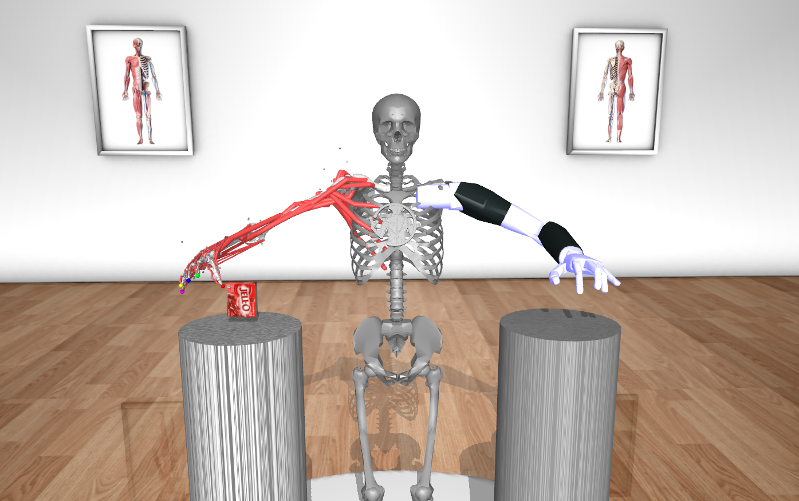
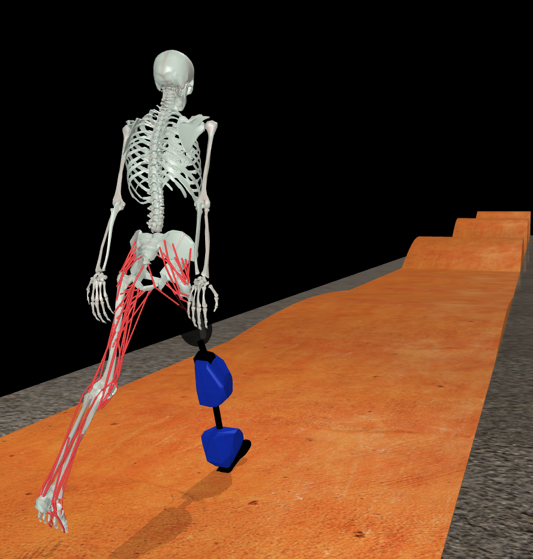

MyoChallenge-2024 Documentations
#############################################

* :ref:`challenge24_manipulation`
* :ref:`challenge24_locomotion`
* :ref:`challenge24_tutorial`

.. _challenge24_manipulation:

Prosthesis Co-Manipulation
--------------------------------------------------------------

A myoHand :ref:`myoHand` model and a Modular Prosthetic Limb (`MPL <https://www.jhuapl.edu/work/projects-and-missions/revolutionizing-prosthetics/research>`__)
involved in moving an object between two tables with a handover. This task requires delicate coordination of the 
object without dropping it or destroying it (maximum force on the object for success) and a mandatory handover between 
the MyoArm and the MPL to move the objects between two locations.

Objective
^^^^^^^^^^^^^^^^^^^^^^^^^^^

Move the object between two locations with a handover between a hand and a prosthesis. The object parameter is randomized in terms 
of object starting location, object target destination (goal position), object weight, and even friction during each environmental reset. 

Evaluation Criteria
^^^^^^^^^^^^^^^^^^^^^^^^^^^^^^

**Task Constrains**

    - In order to finish the task, the object is expected to be within 0.01m from the end goal position
    - The maximum force exerted upon the object does not exceed 1500N any time during the manipulation

**Success Criteria**

    - The task is solved following the constrains
    - The object first has to touch the MyoArm (100 ms), then the MPL (100 ms), and then the end location (100 ms)

The participants will be ranked based on the following criteria hierarchically. 

    1. Finish the task and closeness to the goal position(%)
    2. Time (s)
    3. Total Muscle Effort (-)

.. TODO: can we have how close to the destination here?

Action Space
^^^^^^^^^^^^^^^^^^^^^^^^

.. TODO: muscle actuator different from locomotion

The action spaces includes two types of actuators. Muscles control values are given as continuous values between  :math:`[0, 1]`, details on how 
the mapping take place can be founda at this `mujoco doc <https://mujoco.readthedocs.io/en/stable/modeling.html#cmuscle>`__.

The action for the prosthetic hand is controlled in terms of each joint angle. A normalisation is applied such that all joint angle in radiance can be 
actuated by a control value between  :math:`[-1, 1]`, with -1 and 1 representing the lower and upper bound of the range of motions.

Observation Space
^^^^^^^^^^^^^^^^^^^^^^^^^

+-----------------------------------------+-----------------------------+-----------------+
| **Description**                         |        **Access**           |   **Dimension** |
+-----------------------------------------+-----------------------------+-----------------+
| Time                                    | obs_dict['time']            |  (1x1)          |
+-----------------------------------------+-----------------------------+-----------------+
| Joint positions of myoArm               | obs_dict['myohand_qpos']    | (38x1)          | 
+-----------------------------------------+-----------------------------+-----------------+
| Joint velocity of myoArm                | obs_dict['myohand_qvel"]    | (38x1)          |
+-----------------------------------------+-----------------------------+-----------------+
| Joint positions of MPL                  | obs_dict['pros_hand_qpos"]  | (27x1)          |
+-----------------------------------------+-----------------------------+-----------------+
| Joint velocity of MPL                   | obs_dict['pros_hand_qvel"]  | (27x1)          |
+-----------------------------------------+-----------------------------+-----------------+
| Joint positions of object               | obs_dict['object_qpos"]     | (7x1)           |
+-----------------------------------------+-----------------------------+-----------------+
| Joint velocity of object                | obs_dict['object_qvel"]     | (6x1)           |
+-----------------------------------------+-----------------------------+-----------------+
| Starting position                       | obs_dict['start_pos']       | (2x1)           |
+-----------------------------------------+-----------------------------+-----------------+
| Goal position                           | obs_dict['goal_pos']        | (2x1)           |
+-----------------------------------------+-----------------------------+-----------------+
| Touching information of object          | obs_dict['touching_body']   | (5x1)           |
+-----------------------------------------+-----------------------------+-----------------+
| Palm location                           | obs_dict['palm_pos']        | (3x1)           |
+-----------------------------------------+-----------------------------+-----------------+
| Finger tip location                     | obs_dict['fin_i']           | (3x5)           |
+-----------------------------------------+-----------------------------+-----------------+
| MPL palm location                       | obs_dict['Rpalm_pos']       | (3x1)           |
+-----------------------------------------+-----------------------------+-----------------+
| Object position                         | obs_dict['obj_pos']         | (3x1)           |
+-----------------------------------------+-----------------------------+-----------------+
| Hand reaching error                     | obs_dict['reach_err']       | (3x1)           |
+-----------------------------------------+-----------------------------+-----------------+
| Hand passing error                      | obs_dict['pass_err']        | (3x1)           |
+-----------------------------------------+-----------------------------+-----------------+
| Muscle activation of myoHand            | obs_dict['act']             | (63x1)          |
+-----------------------------------------+-----------------------------+-----------------+

**Description of observations**

    - Touching information of object in one-hot encoding. Value of which is equal to 1 if the corresponding part is touching the object and 0 otherwise

        - myoArm = value[0]
        - MPL    = value[1]
        - Start  = value[2]
        - Goal   = value[3]
        - The rest = value[4]

    - Finger tip location is accessed by an index i for each finger tips. The index i is in [0-4] and finger 0 is acccessed by obs_dict['fin0']
    
    - Start and Goal positions are 2 dimensional because the height of the two pillars will be constant

    - Hand reaching error measures the distance between the hand and the object

    - Hand passing error measures the distance between the MPL and the object

    - The manipulated object has full 6 degrees of freedom, its state described as a 7 dimensional value in position + quaternion format  it is defined by a "`freejoint <https://mujoco.readthedocs.io/en/stable/XMLreference.html#body-freejoint>`__"

Disclaimer on challenge realism
^^^^^^^^^^^^^^^^^^^^^^^^^^^^^^^^^^^^^^^^^^^^^^^^^^^

A single policy is used to map observations about the entire bimanual task to the control of both arms. This differs from real prosthetic control tasks, where the two separate 
agents (human and device) communicate through a narrow bandwidth human-machine interface (HMI). Usually only 1-4 degrees of freedom are communicated between the two systems, often 
thresholded into a binary channels.
Since bimanual manipulation is already a complex and challenging task, we did not place such a restriction into the environment or submission rules. Single agent solutions should 
indicate an upper limit to performance with a perfect HMI. We encourage you to investigate implementing more realistic multi-agent scenarios after the challenge!

.. _challenge24_locomotion:

Prosthesis Locomotion
---------------------------------

A trans-femoral myoLeg model and a Open Source Leg (`OSL <https://neurobionics.robotics.umich.edu/research/wearable-robotics/open-source-leg/>`__)  involved 
in walking over different terrain types. The task requires learning the dynamics and control of a powered prosthetic leg that has its own controller. 
This is similar to how people with limb loss learn to adapt to a prosthetic leg over time. This task also requires navigation over different terrain 
with increasing difficulty.

Objective
^^^^^^^^^^^^^^^^^^^^^^^^^^^

Traverse over different terrain types with a prosthetic leg. Randomization will be done with:

    - Terrain Types:
        - Flat Ground
        - Rough Ground
        - Slopes
        - Stairs
    - Difficulty of Terrain
        - Rough: Increasing roughness
        - Slopes: Increasing steepness of Slopes
        - Stairs: Increasing height of stairs

.. figure:: images/Myotrack_promo_2.png
    :width: 600
    :align: center

    Example of increasing difficulty of obstacles

Only 1 terrain type will be present in each episode. Mixed terrains in a single episode may be implemented to increase the 
difficulty of the challenge for the purposes of tie-breaking.

**Learning interactions with prosthetic leg**

The primary way to interact with the prosthetic leg is via socket interaction forces on the residual limb (which are provided 
in the observations). A state-based impedance controller would provide the commands to move the prosthetic limb and participants 
are provided with the corresponding APIs to update the impedance controller.

For task evaluation, there are no direct observations and control over the prosthetic leg. Angles, angular velocities and torque 
of the prosthetic leg will not be available in the observations. Similarly, there is no commanded position, velocity or torques 
for the prosthetic leg.

Evaluation Criteria
^^^^^^^^^^^^^^^^^^^^^^^^^^^^^^^^^^^^^

Submission are evaluated on the distance traveled over a fixed time horizon on the pre-defined track. The submission must stay on
the track to receive full credits.

Action Space
^^^^^^^^^^^^^^^^^^^^^^^^^^^^

Muscles control values are given as continuous values between  :math:`[-1, 1]`. Normalization to a range of :math:`[0, 1]` is done in the environment 
according to the equation

.. math::

    1 / ( 1 + exp(-5 * (muscleCtrl - 0.5) ) )

For participants that do not wish to use this normalization feature, it can be done during environment initialization with:

:code:`env = gym.make(“myoChallengeRunTrackP1-v0”, normalize_act=False)`

where in this case, the control range of the muscles are set between :math:`[0, 1]` without any normalization performed.
Commanded torque values are generated by an embedded :ref:`challenge24_state_machine`. Refer to the section below for more information.

Observation Space
^^^^^^^^^^^^^^^^^^^^^^^^^^^^^

+-----------------------------------------+-----------------------------+-----------------+
| **Description**                         |        **Access**           |   **Dimension** |
+-----------------------------------------+-----------------------------+-----------------+
| Time                                    |      obs_dict['time']       |        (1x1)    |
+-----------------------------------------+-----------------------------+-----------------+
| Terrain type (see below)                |   obs_dict['terrain']       | (1x1)           |
+-----------------------------------------+-----------------------------+-----------------+
| Torso angle                             |                             |                 |
| (quaternion in world frame)             |   obs_dict['torso_angle']   |  (4x1)          |
+-----------------------------------------+-----------------------------+-----------------+
| Joint positions                         |                             |                 |
| (except those from the prosthetic leg)  | obs_dict['internal_qpos']   |  (21x1)         | 
+-----------------------------------------+-----------------------------+-----------------+
| Joint velocities                        |                             |                 | 
| (except those from the prosthetic leg)  | obs_dict['internal_qvel']   | (21x1)          | 
+-----------------------------------------+-----------------------------+-----------------+
| Ground reaction forces                  | obs_dict['grf']             |  (2x1)          |
| (only for biological leg)               |                             |                 |
+-----------------------------------------+-----------------------------+-----------------+
| Socket forces (see below)               | obs_dict['socket_force']    | (3x1)           |
+-----------------------------------------+-----------------------------+-----------------+
| Muscle activations                      | obs_dict['act']             | (54x1)          |
+-----------------------------------------+-----------------------------+-----------------+
| Muscle length                           | obs_dict['muscle_length']   |  (54x1)         |
+-----------------------------------------+-----------------------------+-----------------+
| Muscle velocities                       | obs_dict['muscle_velocity'] | (54x1)          |
+-----------------------------------------+-----------------------------+-----------------+
| Muscle forces                           | obs_dict['muscle_force']    | (54x1)          |
+-----------------------------------------+-----------------------------+-----------------+
| Model center of mass position           |                             |  (3x1)          |
| (in world frame)                        |  obs_dict['model_root_pos'] |                 |
+-----------------------------------------+-----------------------------+-----------------+
| Model center of mass velocity           |  obs_dict['model_root_vel'] |   (3x1)         |
| (in world frame)                        |                             |                 |
+-----------------------------------------+-----------------------------+-----------------+
| Height map                              |  obs_dict['hfield']         | (100x1)         |
+-----------------------------------------+-----------------------------+-----------------+

**Description of observations**

    - Terrain type codes are given as:

        - FLAT = 0
        - HILLY = 1
        - ROUGH = 2
        - STAIRS = 3

    - Socket forces

        - Represented as a 3-DOF force vector. Note that the direction of the force sensor is from the bottom of the socket projecting to the residual limb (i.e. the vertical axis force into the residual limb is negative). Processing of the observations is left to the participant’s discretion.
    
    - Height Map

        - The height map is a 10x10 grid (flattened to a 100x1), centered around the center of the MyoOSL model. This is a simple representation of a visual input of the terrain around the model.

.. _challenge24_state_machine:

State Machine
^^^^^^^^^^^^^^^^^^^^^^^^^^^^^^^^^^^^

A simple 4-state state machine is created to track the gait phase of the prosthetic leg. Each state contains the gain parameters 
for an impedance controller, which in turn, provides the required torques to the prosthetic actuators. The code for the state machine 
is released together with MyoChallenge. Interested participants are invited to examine the code at 
`myoosl_control <https://github.com/MyoHub/myosuite/blob/dev/myosuite/envs/myo/assets/leg/myoosl_control.py>`__

Parameters of the impedance controller are taken from `finite_state_machine <https://opensourceleg.readthedocs.io/en/latest/examples/finite_state_machine.html>`__

Gait phases in the state machine are divide into:

    1. Early Stance (e_stance)
    2. Late Stance (l_stance)
    3. Early Swing (e_swing)
    4. Late Swing (l_swing)

List of states variables:

    - States

        - ["e_stance", "l_stance", "e_swing", "l_swing"]

    - Impedance controller parameters (for both knee and ankle actuators)

        - Stiffness
        - Damping
        - Target angle

    - State transition thresholds

        - Load
        - Knee angle
        - Knee velocity
        - Ankle angle
        - Ankle velocity

.. _challenge24_tutorial:

Challenge Tutorial
--------------------------------------------------------------

This section aims to provide an basics to get start of the challenge.

For a step-by-step tutorial, please check our :ref:`tutorials` page :ref:`use_reinforcement_learning` and :ref:`baselines` page.

To obtain a more in-depth understanding of the challenge, we have prepared baselines for both of the challenges.
Links are available for `manipulation <https://colab.research.google.com/drive/1AqC1Y7NkRnb2R1MgjT3n4u02EmSPem88#scrollTo=-mAnRvYjIS4d>`__, 
`locomotion <https://colab.research.google.com/drive/1AFbVlwnGDYD45XqMYBaYjf5xOOa_KEXd?usp=sharing>`__.

.. code-block:: python

    from myosuite.utils import gym
    # Include the locomotion track environment, uncomment to select the manipulation challenge
    env = gym.make('myoChallengeRunTrackP1-v0')
    #env = gym.make('myoChallengeBimanual-v0')
    

    env.reset()

    # Repeat 1000 time steps
    for _ in range(1000):

        # Activate mujoco rendering window
        env.mj_render()

        # Get observation from the envrionment, details are described in the above docs
        obs = env.get_obs()
        current_time = obs['time']
        #print(current_time)

        # Take random actions
        action = env.action_space.sample()

        # Environment provides feedback on action
        next_obs, reward, terminated, truncated, info = env.step(action)

        # Reset training if env is terminated
        if terminated:
            next_obs, info = env.reset()

.. TODO: locomotion colab page is missing