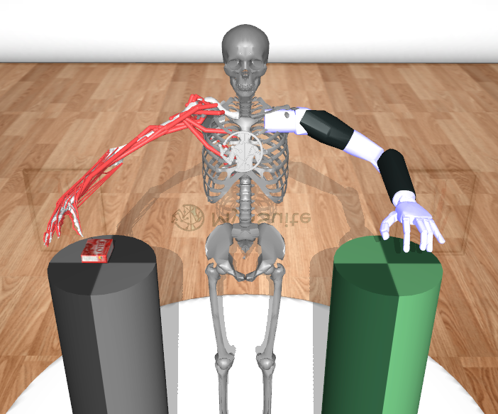
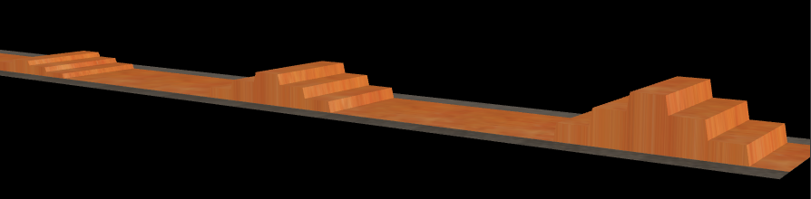

MyoChallenge-2024 Documentations
#############################################

* :ref:`challenge24_manipulation`
* :ref:`challenge24_locomotion`
* :ref:`challenge24_tutorial`
* :ref:`challenge24_disclaimer`

.. _challenge24_manipulation:

Prosthesis Co-Manipulation
--------------------------------------------------------------

A :ref:`myoArm` model and a Modular Prosthetic Limb (`MPL <https://www.jhuapl.edu/work/projects-and-missions/revolutionizing-prosthetics/research>`__)
involved in moving an object between two tables with a handover. This task requires delicate coordination of the 
object without dropping it or destroying it (maximum force on the object for success), and a mandatory handover between 
the MyoArm and the MPL to move the objects between two locations.

Objective
^^^^^^^^^^^^^^^^^^^^^^^^^^^

Move the object between two locations with a handover between a hand and a prosthesis. The task parameters will be randomized to provide a comprehensive 
test to the controller's performance. The randomization will include but not limited to: object type, object weight and even friction during each environmental reset. 

Action Space
^^^^^^^^^^^^^^^^^^^^^^^^

The action spaces includes two major parts, the :ref:`myoArm` and the `MPL <https://www.jhuapl.edu/work/projects-and-missions/revolutionizing-prosthetics/research>`__. 
Muscles control values for myoArm are given as continuous values between  :math:`[0, 1]`, details on how this value to force mapping take place can be founda at 
this `mujoco doc <https://mujoco.readthedocs.io/en/stable/modeling.html#cmuscle>`__.

The action for the prosthetic hand is controlled in terms of each joint angle. A normalisation is applied such that all joint angle in radiance can be 
actuated by a control value between  :math:`[-1, 1]`, with -1 and 1 representing the lower and upper bound of the range of motions.

Observation Space
^^^^^^^^^^^^^^^^^^^^^^^^^

The obs_dict variable contains useful features that are used to create observation vectors (configured via obs_keys) and for computing environment rewards (configures get_reward_dict(.) 
in via weighted_reward_keys).

During training, participants are encouraged to add new keys to the obs_dict to further aid their reward computations. Note that the values obtained outside the provided obs_dict, 
or directly from the simulator might not be accessible during submission evaluations.

.. temporary change backup
.. +-----------------------------------------+-----------------------------+-----------------+
.. | **Description**                         |        **Access**           |   **Dimension** |
.. +-----------------------------------------+-----------------------------+-----------------+
.. | Time                                    | obs_dict['time']            |  (1x1)          |
.. +-----------------------------------------+-----------------------------+-----------------+
.. | Joint positions of myoArm               | obs_dict['myohand_qpos']    | (38x1)          | 
.. +-----------------------------------------+-----------------------------+-----------------+
.. | Joint velocity of myoArm                | obs_dict['myohand_qvel']    | (38x1)          |
.. +-----------------------------------------+-----------------------------+-----------------+
.. | Joint positions of MPL                  | obs_dict['pros_hand_qpos']  | (27x1)          |
.. +-----------------------------------------+-----------------------------+-----------------+
.. | Joint velocity of MPL                   | obs_dict['pros_hand_qvel']  | (26x1)          |
.. +-----------------------------------------+-----------------------------+-----------------+
.. | Joint positions of object               | obs_dict['object_qpos']     | (7x1)           |
.. +-----------------------------------------+-----------------------------+-----------------+
.. | Joint velocity of object                | obs_dict['object_qvel']     | (6x1)           |
.. +-----------------------------------------+-----------------------------+-----------------+
.. | Contact information of object           | obs_dict['touching_body']   | (5x1)           |
.. +-----------------------------------------+-----------------------------+-----------------+
.. | Starting position                       | obs_dict['start_pos']       | (2x1)           |
.. +-----------------------------------------+-----------------------------+-----------------+
.. | Goal position                           | obs_dict['goal_pos']        | (2x1)           |
.. +-----------------------------------------+-----------------------------+-----------------+
.. | Muscle activation of myoHand            | obs_dict['act']             | (63x1)          |
.. +-----------------------------------------+-----------------------------+-----------------+
.. | Palm location                           | obs_dict['palm_pos']        | (3x1)           |
.. +-----------------------------------------+-----------------------------+-----------------+
.. | Finger tip location                     | obs_dict['fin_i']           | (3x5)           |
.. +-----------------------------------------+-----------------------------+-----------------+
.. | MPL palm location                       | obs_dict['Rpalm_pos']       | (3x1)           |
.. +-----------------------------------------+-----------------------------+-----------------+
.. | Object position                         | obs_dict['obj_pos']         | (3x1)           |
.. +-----------------------------------------+-----------------------------+-----------------+
.. | Hand reaching error                     | obs_dict['reach_err']       | (3x1)           |
.. +-----------------------------------------+-----------------------------+-----------------+
.. | Hand passing error                      | obs_dict['pass_err']        | (3x1)           |
.. +-----------------------------------------+-----------------------------+-----------------+

+-----------------------------------------+-----------------------------+-----------------+
| **Description**                         |        **Access**           |   **Dimension** |
+-----------------------------------------+-----------------------------+-----------------+
| Time                                    | obs_dict['time']            |  (1x1)          |
+-----------------------------------------+-----------------------------+-----------------+
| Joint positions of myoArm               | obs_dict['myohand_qpos']    | (38x1)          | 
+-----------------------------------------+-----------------------------+-----------------+
| Joint velocity of myoArm                | obs_dict['myohand_qvel']    | (38x1)          |
+-----------------------------------------+-----------------------------+-----------------+
| Joint positions of MPL                  | obs_dict['pros_hand_qpos']  | (27x1)          |
+-----------------------------------------+-----------------------------+-----------------+
| Joint velocity of MPL                   | obs_dict['pros_hand_qvel']  | (26x1)          |
+-----------------------------------------+-----------------------------+-----------------+
| Joint positions of object               | obs_dict['object_qpos']     | (7x1)           |
+-----------------------------------------+-----------------------------+-----------------+
| Joint velocity of object                | obs_dict['object_qvel']     | (6x1)           |
+-----------------------------------------+-----------------------------+-----------------+
| Contact information of object           | obs_dict['touching_body']   | (5x1)           |
+-----------------------------------------+-----------------------------+-----------------+
| Starting position                       | obs_dict['start_pos']       | (3x1)           |
+-----------------------------------------+-----------------------------+-----------------+
| Goal position                           | obs_dict['goal_pos']        | (3x1)           |
+-----------------------------------------+-----------------------------+-----------------+
| Muscle activation of myoHand            | obs_dict['act']             | (63x1)          |
+-----------------------------------------+-----------------------------+-----------------+
| Hand reaching error                     | obs_dict['reach_err']       | (3x1)           |
+-----------------------------------------+-----------------------------+-----------------+
| Hand passing error                      | obs_dict['pass_err']        | (3x1)           |
+-----------------------------------------+-----------------------------+-----------------+

**Description of observations**

    - Touching information of object in one-hot encoding. Value of which is equal to 1 if the corresponding part is touching the object and 0 otherwise

        - myoArm = value[0]
        - MPL    = value[1]
        - Start  = value[2]
        - Goal   = value[3]
        - The rest = value[4]

    
    - Start and Goal positions are 3 dimensional position to pick and place the object

    - Hand reaching error measures the distance between the hand and the object

    - Hand passing error measures the distance between the MPL and the object

    - The manipulated object has full 6 degrees of freedom, its state described as a 7 dimensional value in position + quaternion format. Details can be found in "`mujoco-freejoint <https://mujoco.readthedocs.io/en/stable/XMLreference.html#body-freejoint>`__" page

**Variation on Object Properties**

Both the geometry and physical properties of the object as well as the environment can be sampled at the start of each episode to provide variability in the task. Provided 
below is an example of how real-world scenarios is captured in the test environments we provide.

    - Object scale: a +- change in respective geom directions ( between 0% - 5%, 0% - 10% in myoChallengeBimanual-v0)
    - Object Mass: an upper/lower bound of X gms (X = 50 in myoChallengeBimanual-v0)
    - Object Friction: a +- change between 0 - 0.1, 0 - 0.001, 0 - 0.00002 from nominal value: [1.0, 0.005, 0.0001] in respective geom direction in (myoChallengeBimanual-v0)

Note that these distributions may be different in the final evaluation environment. Try to maintain the performance of your policies in as wide a range as possible.

Success Condition
^^^^^^^^^^^^^^^^^^^^^^^^^

    - The object moved from start position to goal position. Both the MPL hand, and MyoHand, is required to touch the object for certain timesteps 
    - Exerting a maximum contact force on the object, less than 1500N (subject to change in final EVALUATION environment)
    - Placing the object within 0.05 meters of the goal site on the pillar

Ranking Criteria
^^^^^^^^^^^^^^^^^^^^^^^^^

Individual model performance is evaluated in terms of the following criterias. Please note that the evaluation process will follow a hierarchical approach, 
where the first criterion is the primary determinant of success. Only in cases where candidates are tied based on the first criterion will the second criterion be considered. 

    1. Task success rate (successful_attempts / total_attempts)
    2. Total time to complete the task (failed_attemps will be punished for a time of full episode length)
    3. Minimum total muscle activation

.. _challenge24_locomotion:

Prosthesis Locomotion
---------------------------------

A trans-femoral :ref:`myoLeg` model and a Open Source Leg (`OSL <https://neurobionics.robotics.umich.edu/research/wearable-robotics/open-source-leg/>`__)  involved 
in walking over different terrain types. The task requires learning the dynamics and control of a powered prosthetic leg that has its own controller. 
This is similar to how people with limb loss learn to adapt to a prosthetic leg over time. This task also requires navigation over different terrain 
with increasing difficulty.

.. image:: images/MyoChallenge24_loco_1.png
  :width: 350
  :align: center
  :alt: Text

Objective
^^^^^^^^^^^^^^^^^^^^^^^^^^^

Traverse over different terrain types with the :ref:`myoLeg` and a prosthetic leg(`OSL <https://neurobionics.robotics.umich.edu/research/wearable-robotics/open-source-leg/>`__). 
Randomization will take place for challenge difficulty level. For example, the terrain type might change with added obstacles.

    Example of increasing difficulty of obstacles

**Learning interactions with prosthetic leg**

The primary way to interact with the prosthetic leg is via socket interaction forces on the residual limb (which are provided 
in the observations). A state-based impedance controller would provide the commands to move the prosthetic limb and participants 
are provided with the corresponding APIs to update the impedance controller.

For the task realism, there are no direct observations and control over the prosthetic leg. Angles, angular velocities and torque 
of the prosthetic leg will not be available in the observations. Similarly, there is no commanded position, velocity or torques 
for the prosthetic leg.

Action Space
^^^^^^^^^^^^^^^^^^^^^^^^^^^^

Muscles control values for :ref:`myoLeg` are given as continuous values between  :math:`[-1, 1]`. Normalization to a range of :math:`[0, 1]` is done in the environment 
according to the equation:

.. math::

    1 / ( 1 + exp(-5 * (muscleCtrl - 0.5) ) )

For participants that do not wish to use this normalization feature, it can be done during environment initialization with:

:code:`env = gym.make(myoChallengeOslRunFixed-v0”, normalize_act=False)`

where in this case, the control range of the muscles are set between :math:`[0, 1]` without any normalization performed.

The action space only includes the control of the muscles in the biological leg and residual muscles of the leg on the prosthetic side, with a total of 54 dimensions.
To control the prothetic leg `OSL <https://neurobionics.robotics.umich.edu/research/wearable-robotics/open-source-leg/>`__, 
commanded torque values are generated by an embedded state machine. Refer to the section on :ref:`challenge24_state_machine` for more information.

Observation Space
^^^^^^^^^^^^^^^^^^^^^^^^^^^^^

+-----------------------------------------+-----------------------------+-----------------+
| **Description**                         |        **Access**           |   **Dimension** |
+-----------------------------------------+-----------------------------+-----------------+
| Time                                    |      obs_dict['time']       |        (1x1)    |
+-----------------------------------------+-----------------------------+-----------------+
| Terrain type (see below)                |   obs_dict['terrain']       | (1x1)           |
+-----------------------------------------+-----------------------------+-----------------+
| Torso angle                             |                             |                 |
| (quaternion in world frame)             |   obs_dict['torso_angle']   |  (4x1)          |
+-----------------------------------------+-----------------------------+-----------------+
| Joint positions                         |                             |                 |
| (except those from the prosthetic leg)  | obs_dict['internal_qpos']   |  (21x1)         | 
+-----------------------------------------+-----------------------------+-----------------+
| Joint velocities                        |                             |                 | 
| (except those from the prosthetic leg)  | obs_dict['internal_qvel']   | (21x1)          | 
+-----------------------------------------+-----------------------------+-----------------+
| Ground reaction forces                  | obs_dict['grf']             |  (2x1)          |
| (only for biological leg)               |                             |                 |
+-----------------------------------------+-----------------------------+-----------------+
| Socket forces (see below)               | obs_dict['socket_force']    | (3x1)           |
+-----------------------------------------+-----------------------------+-----------------+
| Muscle activations                      | obs_dict['act']             | (54x1)          |
+-----------------------------------------+-----------------------------+-----------------+
| Muscle length                           | obs_dict['muscle_length']   |  (54x1)         |
+-----------------------------------------+-----------------------------+-----------------+
| Muscle velocities                       | obs_dict['muscle_velocity'] | (54x1)          |
+-----------------------------------------+-----------------------------+-----------------+
| Muscle forces                           | obs_dict['muscle_force']    | (54x1)          |
+-----------------------------------------+-----------------------------+-----------------+
| Model center of mass position           |                             |  (3x1)          |
| (in world frame)                        |  obs_dict['model_root_pos'] |                 |
+-----------------------------------------+-----------------------------+-----------------+
| Model center of mass velocity           |  obs_dict['model_root_vel'] |   (3x1)         |
| (in world frame)                        |                             |                 |
+-----------------------------------------+-----------------------------+-----------------+
| Height map                              |  obs_dict['hfield']         | (100x1)         |
+-----------------------------------------+-----------------------------+-----------------+

**Description of observations**

    - Terrain type codes are given as:

        - FLAT = 0
        - HILLY = 1
        - ROUGH = 2
        - STAIRS = 3

    - Socket forces

        - Represented as a 3-DOF force vector. Note that the direction of the force sensor is from the bottom of the socket projecting to the residual limb (i.e. the vertical axis force into the residual limb is negative). Processing of the observations is left to the participant’s discretion.
    
    - Height Map

        - The height map is a 10x10 grid (flattened to a 100x1), centered around the center of the MyoOSL model. This is a simple representation of a visual input of the terrain around the model.

.. _challenge24_state_machine:

State Machine
^^^^^^^^^^^^^^^^^^^^^^^^^^^^^^^^^^^^^^^^^

A simple 4-state state machine is created to track the gait phase of the prosthetic leg. Each state contains the gain parameters 
for an impedance controller, which in turn, provides the required torques to the prosthetic actuators. The code for the state machine 
is released together with MyoChallenge. Interested participants are invited to examine the code at 
`myoosl_control <https://github.com/MyoHub/myosuite/blob/dev/myosuite/envs/myo/assets/leg/myoosl_control.py>`__

Default parameters of the impedance controller are taken from `finite_state_machine <https://opensourceleg.readthedocs.io/en/latest/examples/finite_state_machine.html>`__

Gait phases in the state machine are divide into:

    1. Early Stance (e_stance)
    2. Late Stance (l_stance)
    3. Early Swing (e_swing)
    4. Late Swing (l_swing)

List of states variables:

    - States

        - ["e_stance", "l_stance", "e_swing", "l_swing"]

    - Impedance controller parameters (for both knee and ankle actuators)

        - Stiffness
        - Damping
        - Target angle

    - State transition thresholds

        - Load
        - Knee angle
        - Knee velocity
        - Ankle angle
        - Ankle velocity

Participants are expected to modify the state paramters of the OSL state machine to tackle this challenge. Given that there are multiple terrain types in the MyoChallenge,
we provide a structure that allows 4 sets of state paramters to be uploaded to the state machine. Participants can then freely switch between paramter sets during each episode by calling the required function.

More details of the functions are here below:

- upload_osl_param(dict_of_dict) `upload_osl_param <https://github.com/MyoHub/myosuite/blob/main/myosuite/envs/myo/myochallenge/run_track_v0.py#L717>`__
    - This function expects a dictionary of dictionary containing state parameter values
    - Dictionary overview: top_level_dict[x][y][z][val]
        - top_level_dict[x], where x = [0,1,2,3], which are integers
        - y = {'e_stance', 'l_stance', 'e_swing', 'l_swing'}, which are string values denoting the gait phase
        - z = {'gains', 'threshold'}, which are categories of the state parameters
        - val = {'knee_stiffness', 'knee_damping', 'knee_target_angle', 'ankle_stiffness', 'ankle_damping', 'ankle_target_angle'} *(for gains)* and {'load', 'knee_angle', 'knee_velocity', 'ankle_angle', 'ankle_velocity} *(for thresholds)*
    - Note that not all parameters are used at every state. It is recommended to examine the default structure `here <https://github.com/MyoHub/myosuite/blob/main/myosuite/envs/myo/assets/leg/myoosl_control.py#L181>`__ for more information.

- change_osl_mode(mode=0) `change_osl_mode <https://github.com/MyoHub/myosuite/blob/main/myosuite/envs/myo/myochallenge/run_track_v0.py#L725>`__
    - This function changes the paramter set that the OSL state machine currently using. Do note that this change is immediate and the impedance controller will generate torques using the new paramter set at the next timestep.

Testing environment
^^^^^^^^^^^^^^^^^^^^^^^^^^^^^^^^^^^^^^^

To increase the accessibility of the task, two set of testing environment is provided for participants to familiarise themselves with the tasks. 
Please note that the variation parameters are subject to change in the actual evaluation environment.

The two environments are :code:`myoChallengeOslRunRandom-v0` and :code:`myoChallengeOslRunFixed-v0` and can be accessed via :code:`env = gym.make(“myoChallengeOslRunRandom-v0”, normalize_act=False)`

The :code:`myoChallengeOslRunFixed-v0` environment is a simplified version of the :code:`myoChallengeOslRunRandom-v0` environment for participants to begin with, with a flat ground, but 100m track

The :code:`myoChallengeOslRunRandom-v0` similarly includes a 100 meters track, with a 20m initial stretch of flat ground, and the remaining 80m of increasingly difficult terrain

The environment in evaluation will be similar to the :code:`myoChallengeOslRunRandom-v0` environment

Both environments can be customized for ML or non-ML usage. For participants using ML-based methods, the action space can be set to between [-1 to 1] for both training and your submission with the normalize_act 
argument during environment creation. For participants using non-ML based methods, setting normalize_act=False would provide you with the muscle action space to be between [0 to 1]

During training, you can set this option with env = gym.make(env_name, normalize_act=True) for the action space [-1 to 1] and normalize_act=False for action space [0 to 1]

Success Condition
^^^^^^^^^^^^^^^^^^^^^^^^^

    - The performance will be evaluated on multiple episoids under varying conditions to ensure a comprehensive evaluation. The performance will be assessed based on their average outcome across episoids.
    - The controller needs to walk for at least 20 meters before considered for ranking without falling

Ranking Criteria
^^^^^^^^^^^^^^^^^^^^^^^^^^^^^^^^^^^^^^^^^^^^^^^^

Individual model performance is evaluated in terms of the following criterias. Please note that the evaluation process will follow a hierarchical approach, 
where the first criterion is the primary determinant of success. Only in cases where candidates are tied based on the first criterion will the second criterion be considered. 

    1. Average distance travelled (ranked in descending order)
    2. Average time of completion (ranked in ascending order)
    3. Minimum physiological criteria (Pain) : Measured by the average amount of overextension torque on each rotational joint of MyoLeg as a representation of pain
    4. Minimum total muscle activation: Measured by the total muscle activation during the task to estimate metabolic power

.. _challenge24_tutorial:

Challenge Tutorial
--------------------------------------------------------------

This section aims to provide an basics to get start of the challenge.

For a step-by-step tutorial, please check our :ref:`tutorials` page :ref:`use_reinforcement_learning` and :ref:`baselines` page.

To obtain a more in-depth understanding of the challenge, we have prepared baselines for both of the challenges.
Links are available for `manipulation <https://colab.research.google.com/drive/1AqC1Y7NkRnb2R1MgjT3n4u02EmSPem88#scrollTo=-mAnRvYjIS4d>`__, 
`locomotion <https://colab.research.google.com/drive/1AFbVlwnGDYD45XqMYBaYjf5xOOa_KEXd?usp=sharing>`__.

.. code-block:: python

    from myosuite.utils import gym
    # Include the locomotion track environment, uncomment to select the manipulation challenge
    # env = gym.make('myoChallengeOslRunRandom-v0')
    env = gym.make('myoChallengeBimanual-v0')
    

    env.reset()

    # Repeat 1000 time steps
    for _ in range(1000):

        # Activate mujoco rendering window
        env.mj_render()

        # Select skin group
        geom_1_indices = np.where(env.sim.model.geom_group == 1)
        # Change the alpha value to make it transparent
        env.sim.model.geom_rgba[geom_1_indices, 3] = 0

        # Get observation from the envrionment, details are described in the above docs
        obs = env.get_obs()
        current_time = obs['time']
        #print(current_time)

        # Take random actions
        action = env.action_space.sample()

        # Environment provides feedback on action
        next_obs, reward, terminated, truncated, info = env.step(action)

        # Reset training if env is terminated
        if terminated:
            next_obs, info = env.reset()

.. _challenge24_disclaimer:

Challenge disclaimer on test and evaluation environments
--------------------------------------------------------------

This challenge aims to provide a simulated environment that captures the complexity of real-world scenarios. In order for participants to familiarise themselves with the tasks, 
we have opened the portal for a TEST environment to begin with. Please note that even though the tasks and evaluation criteria will stay the same, there might be difference in the 
changing factors' distributions in the final EVALUATION environment. Please try to maintain the robustness of your policies in as wide a range as possible.
