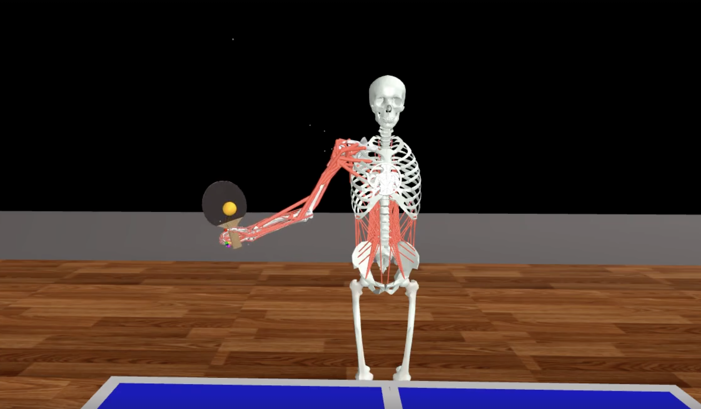

MyoChallenge-2025 Documentations
#############################################

* :ref:`challenge25_table_tennis_manipulation`
* :ref:`challenge25_soccer_locomotion`
* :ref:`challenge25_tutorial`

.. _challenge25_table_tennis_manipulation:

Table Tennis Manipulation
--------------------------------------------------------------

Task Description: Using a paddle, the agent must hit a pingpong ball such that the ball lands on the opponent's side. This task requires coordination of a 
'myoArm' model and a 'myoTorso' model as to allow the agent to accurately hit the pingpong ball without missing and allowing enough force so that the ball 
reaches within the dimensions of the opponent's side. 

Objective
^^^^^^^^^^^^^^^^^^^^^^^^^^^

To develop a general policy to  engage in a high-speed rally.
Move the ball from the agent's side to the opposite side by hitting the ball with a paddle.

Action Space
^^^^^^^^^^^^^^^^^^^^^^^^
The action space includes three major parts, the :ref:`myoArm`, consisting of 63 muscles, the :ref:`myoTorso`, consisting of 210 muscles 
and two position actuators for pelvis translation in the x,y plane. 

Observation Space
^^^^^^^^^^^^^^^^^^^^^^^^^

.. temporary change backup
.. +-----------------------------------------+-----------------------------+-----------------+
.. | **Description**                         |      **Component**          |   **Count**     |
.. +-----------------------------------------+-----------------------------+-----------------+
.. | Joint Positions                         | body_qpos                   |  (86)           |
.. +-----------------------------------------+-----------------------------+-----------------+
.. | Joint Velocities                        | body_vel                    |  (86)           | 
.. +-----------------------------------------+-----------------------------+-----------------+
.. | Ball Position                           | ball_pos                    |  (3)            |
.. +-----------------------------------------+-----------------------------+-----------------+
.. | Ball Velocity                           | ball_vel                    |  (3)            |
.. +-----------------------------------------+-----------------------------+-----------------+
.. | Paddle Position                         | paddle_pos                  |  (3)            |
.. +-----------------------------------------+-----------------------------+-----------------+
.. | Paddle Velocity                         | paddle_vel                  |  (3)            |
.. +-----------------------------------------+-----------------------------+-----------------+
.. | Paddle Reaching Error                   | reach_err                   |  (3)            |
.. +-----------------------------------------+-----------------------------+-----------------+
.. | Muscle Activations                      | muscle_activations          |  (273)          |
.. +-----------------------------------------+-----------------------------+-----------------+
.. | Touching Information                    | touching_info               |  (6)            |
.. +-----------------------------------------+-----------------------------+-----------------+

+-----------------------------------------+-----------------------------+-----------------+
| **Description**                         |      **Component**          |     **Count**   |
+-----------------------------------------+-----------------------------+-----------------+
| Joint Positions                         | body_qpos                   | (86)            |
+-----------------------------------------+-----------------------------+-----------------+
| Joint Velocities                        | body_vel                    | (86)            | 
+-----------------------------------------+-----------------------------+-----------------+
| Ball Position                           | ball_pos                    | (3)             |
+-----------------------------------------+-----------------------------+-----------------+
| Ball Velocity                           | ball_vel                    | (3)             |
+-----------------------------------------+-----------------------------+-----------------+
| Paddle Position                         | paddle_pos                  | (3)             |
+-----------------------------------------+-----------------------------+-----------------+
| Paddle Velocity                         | paddle_vel                  | (3)             |
+-----------------------------------------+-----------------------------+-----------------+
| Paddle Reaching Error (see below)       | reach_err                   | (3)             |
+-----------------------------------------+-----------------------------+-----------------+
| Muscle Activations                      | muscle_activations          | (273)           |
+-----------------------------------------+-----------------------------+-----------------+ 
| Touching Information (see below)        | touching_info               | (6)             |
+-----------------------------------------+-----------------------------+-----------------+

**Description of observations**

    - The paddle reaching error measures the distance between the MPL and the object
    - The touching information indicates contact with various objects in the environment:
        - Paddle: Whether the paddle is in contact with another object.
        - Own: Whether the agent is in contact with itself.
        - Opponent: Whether the agent is in contact with an opponent agent.
        - Ground: Whether the agent is in contact with the ground.
        - Net: Whether the ball has contacted the net.
        - Env: Whether there is contact with any part of the environment. 

**Object Properties**

Ping Pong Table:
- Table top:
    Total: 1.37 x 1.52 x 1.59 m^3
    Per side (agent/opponent): 0.685 x 0.76 x 0.795 m^3
- Net dimensions: 0.005 x 0.9125 x 0.1525 m^3

Paddle:
- Handle: radius = 0.016m, height = 0.051 m
- Face: radius = 0.093m, height = 0.020 m
- Mass: 100 g

Ball:
- Radius: 0.02m
- Mass: 2.7 g
- Inertia: 7.2e-7 kgm^2

Starting Criteria: Phase 1
^^^^^^^^^^^^^^^^^^^^^^^^^^^^
- The ball starts at the same position with the same speed
- The agent has the same starting position
- The paddle is fixed to the hand with the ball joint

Success Criteria
^^^^^^^^^^^^^^^^^^^^^^^^^

- The ball is hit by the paddle once and only once
- The ball does not have contact with the agent's side of the table
- The ball hits the opponent's side of the table

Ranking Criteria
^^^^^^^^^^^^^^^^^^^^^^^^^

1. Success rate (of hitting the ball) (successful_attempts / total_attempts)
2. Effort: based on muscle activation energy

Soccer Locomotion
--------------------------------------------------------------

Task Description: The locomotion task focuses on goal-scoring using dynamic muscular control. It is split into two phases.
Phase 1:
    The human model is placed in a fixed starting location, directly in front of the ball, which is also placed in a fixed starting location. 
Phase 2 (upcoming) :
    The ball is placed in a fixed starting location. The human model is placed at random locations within a fixed radius of the ball, 
    and as before always placed in front of the ball. As well, a goalkeeper model is present, following a public policy with static and random movement. 

Objective
^^^^^^^^^^^^^^^^^^^^^^^^^^^

To develop policies that allow for coordinated locomotion and kicking of a ball to score goals 
in a net with and without a goalkeeper.

Action Space
^^^^^^^^^^^^^^^^^^^^^^^^
The action space includes two major parts, the :ref:`myoLeg`, consiting of 80 leg muscles, and the `myoBack`, consisting of 210 lumabr muscles. 

Observation Space
^^^^^^^^^^^^^^^^^^^^^^^^^

.. temporary change backup
.. +-----------------------------------------+-----------------------------+-----------------+
.. | **Description**                         |      **Component**          |   **Count**     |
.. +-----------------------------------------+-----------------------------+-----------------+
.. | Ball Position                           |                             | (3)             |
.. +-----------------------------------------+-----------------------------+-----------------+
.. | 4 Position Coords (bounding goal area)  |                             | (12)            | 
.. +-----------------------------------------+-----------------------------+-----------------+
.. | Muscles Activations                     |                             | (290)           |
.. +-----------------------------------------+-----------------------------+-----------------+
.. | Joint Angles                            |                             | ()              |
.. +-----------------------------------------+-----------------------------+-----------------+
.. | Ground Contact Forces                   |                             | (6)             |
.. +-----------------------------------------+-----------------------------+-----------------+
.. | Ball Contact Forces with Foot           |                             | (3)             |
.. +-----------------------------------------+-----------------------------+-----------------+
.. | Foot Position                           |                             | (6)             |
.. +-----------------------------------------+-----------------------------+-----------------+
.. | Goalkeeper Position (Phase 2)           |                             | (3)             |
.. +-----------------------------------------+-----------------------------+-----------------+

+-----------------------------------------+-----------------------------+-----------------+
| **Description**                         |      **Component**          |     **Count**   |
+-----------------------------------------+-----------------------------+-----------------+
| Ball Position                           |                             | (3)             |
+-----------------------------------------+-----------------------------+-----------------+
| 4 Position Coords (bounding goal area)  |                             | (12)            | 
+-----------------------------------------+-----------------------------+-----------------+
| Muscles Activations                     |                             | (290)           |
+-----------------------------------------+-----------------------------+-----------------+
| Joint Angles                            |                             | ()              |
+-----------------------------------------+-----------------------------+-----------------+
| Ground Contact Forces                   |                             | (6)             |
+-----------------------------------------+-----------------------------+-----------------+
| Ball Contact Forces with Foot           |                             | (3)             |
+-----------------------------------------+-----------------------------+-----------------+
| Foot Position                           |                             | (6)             |
+-----------------------------------------+-----------------------------+-----------------+
| Goalkeeper Position (Phase 2)           |                             | (3)             |
+-----------------------------------------+-----------------------------+-----------------+

**Description of observations**

    - 

**Object Properties**

Soccer Net:
- 

Ball:
- Radius: 
- Mass: 
- Inertia: 

Success Criteria
^^^^^^^^^^^^^^^^^^^^^^^^^

- The ball is kicked by the human model once and only once
- The ball enters within the confines of the soccer net.
- The ball does not come into contact with the goal keeper (Phase 2).

Ranking Criteria
^^^^^^^^^^^^^^^^^^^^^^^^^

1. Number of goals scored
2. Muscle Effort: based on muscle activation energy

