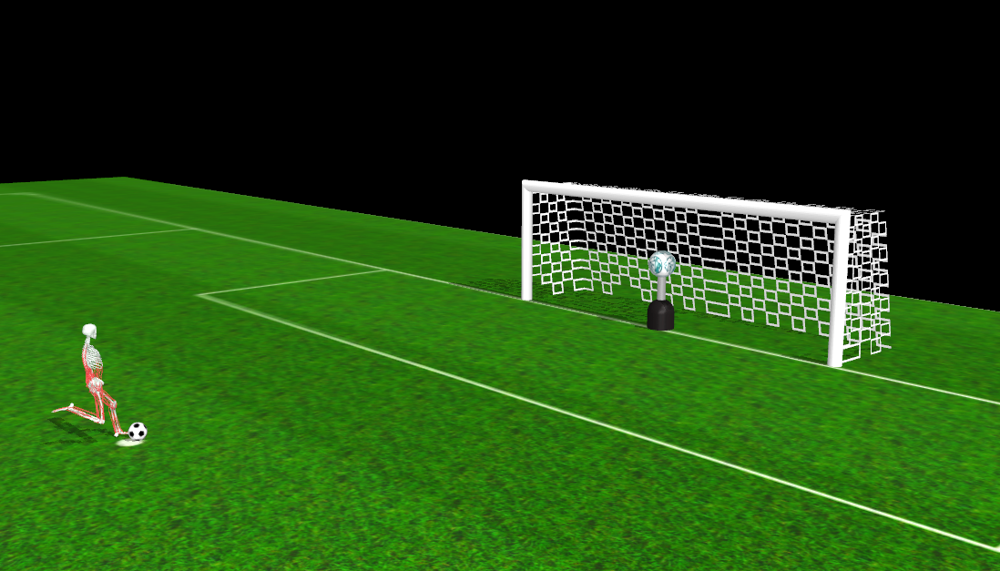

MyoChallenge-2025 Documentations
#############################################

* :ref:`challenge25_table_tennis_rally`
* :ref:`challenge25_soccer_shootout`

.. _challenge25_table_tennis_rally:

Table Tennis Rally
--------------------------------------------------------------

The agent must hit a pingpong ball such that the ball lands on the opponent's side using a paddle. This task requires coordination of a 
'myoArm' model and a 'myoTorso' model as to allow the agent to accurately hit the pingpong ball without missing and allowing enough force 
so that the ball reaches within the dimensions of the opponent's side. 

.. image:: images/MyoChallenge25TableTennis.png
    :width: 450
    :align: center

Objective
^^^^^^^^^^^^^^^^^^^^^^^^^^^

To develop a general policy to  engage in a high-speed rally.
Move the ball from the agent's side to the opposite side by hitting the ball with a paddle.

Action Space
^^^^^^^^^^^^^^^^^^^^^^^^
The action space includes three major parts, the :ref:`myoArm`, consisting of 63 muscles, the :ref:`myoTorso`, consisting of 210 muscles 
and two position actuators for pelvis translation in the x,y plane. 

Observation Space
^^^^^^^^^^^^^^^^^^^^^^^^^

.. temporary change backup
.. +-----------------------------------------+-----------------------------+-----------------+
.. | **Description**                         |      **Component**          |   **Count**     |
.. +-----------------------------------------+-----------------------------+-----------------+
.. | Pelvis Position                         | pelvis_pos                  |  (3)            |
.. +-----------------------------------------+-----------------------------+-----------------+
.. | Joint Positions                         | body_qpos                   |  (58)           |
.. +-----------------------------------------+-----------------------------+-----------------+
.. | Joint Velocities                        | body_vel                    |  (58)           | 
.. +-----------------------------------------+-----------------------------+-----------------+
.. | Ball Position                           | ball_pos                    |  (3)            |
.. +-----------------------------------------+-----------------------------+-----------------+
.. | Ball Velocity                           | ball_vel                    |  (3)            |
.. +-----------------------------------------+-----------------------------+-----------------+
.. | Paddle Position                         | paddle_pos                  |  (3)            |
.. +-----------------------------------------+-----------------------------+-----------------+
.. | Paddle Velocity                         | paddle_vel                  |  (3)            |
.. +-----------------------------------------+-----------------------------+-----------------+
.. | Paddle Orientation                      | paddle_ori                  |  (4)            |
.. +-----------------------------------------+-----------------------------+-----------------+
.. | Paddle Reaching Error                   | reach_err                   |  (3)            |
.. +-----------------------------------------+-----------------------------+-----------------+
.. | Muscle Activations                      | muscle_activations          |  (273)          |
.. +-----------------------------------------+-----------------------------+-----------------+
.. | Touching Information                    | touching_info               |  (6)            |
.. +-----------------------------------------+-----------------------------+-----------------+

+-----------------------------------+--------------------+-----------+
| **Description**                   | **Component**      | **Count** |
+-----------------------------------+--------------------+-----------+
| Pelvis Position                   | pelvis_pos         | 3         |
+-----------------------------------+--------------------+-----------+
| Joint Positions                   | body_qpos          | 58        |
+-----------------------------------+--------------------+-----------+
| Joint Velocities                  | body_vel           | 58        |
+-----------------------------------+--------------------+-----------+
| Ball Position                     | ball_pos           | 3         |
+-----------------------------------+--------------------+-----------+
| Ball Velocity                     | ball_vel           | 3         |
+-----------------------------------+--------------------+-----------+
| Paddle Position                   | paddle_pos         | 3         |
+-----------------------------------+--------------------+-----------+
| Paddle Velocity                   | paddle_vel         | 3         |
+-----------------------------------+--------------------+-----------+
| Paddle Orientation                | paddle_ori         | 3         |
+-----------------------------------+--------------------+-----------+
| Paddle Reaching Error (see below) | reach_err          | 3         |
+-----------------------------------+--------------------+-----------+
| Muscle Activations                | muscle_activations | 273       |
+-----------------------------------+--------------------+-----------+
| Touching Information (see below)  | touching_info      | 6         |
+-----------------------------------+--------------------+-----------+

**Description of observations**

    - The paddle reaching error measures the distance between the MPL and the object
    - The touching information indicates the pingpong ball's contact with various objects in the environment:
        - Paddle: Whether the ball is in contact with the paddle.
        - Own: Whether the ball is in contact with the agent.
        - Opponent: Whether the ball is in contact with an opponent agent.
        - Ground: Whether the ball is in contact with the ground.
        - Net: Whether the ball is in contact with the net.
        - Env: Whether the ball is in contact with any part of the environment. 

**Ping Pong Object Properties**

+-----------------------+----------------------------------+
| **Object**            | **Properties**                   |
+-----------------------+----------------------------------+
| Table Top (Total)     | 2.74 × 1.52 × 1.59 m³            |
+-----------------------+----------------------------------+
| Table Top (Each Side) | 1.37 × 1.52 × 1.59 m³            |
+-----------------------+----------------------------------+
| Net                   | 0.01 × 1.825 × 0.305 m³          |
+-----------------------+----------------------------------+
| Paddle Handle         | Radius: 1.6 cm, Height: 5.1 cm   |
+-----------------------+----------------------------------+
| Paddle Face           | Radius: 9.3 cm, Height: 2 cm     |
+-----------------------+----------------------------------+
| Paddle Mass           | 150 g                            |
+-----------------------+----------------------------------+
| Ball Radius           | 2 cm                             |
+-----------------------+----------------------------------+
| Ball Mass             | 2.7 g                            |
+-----------------------+----------------------------------+
| Ball Inertia          | 7.2×10⁻⁷ kg·m²                   |
+-----------------------+----------------------------------+

Starting Criteria: Phase 1 :code:`myoChallengeTableTennisP1-v0`
^^^^^^^^^^^^^^^^^^^^^^^^^^^^
- The ball starts with the same speed
- The agent has the same starting position
- The paddle initially starts in the grasping position with the hand,
  but is not connected.
- The starting position of the ball is randomly reset between [-1.20, -0.45, 1.50] and [-1.25, -0.50, 1.40] in x, y, z direction respectively at the start of the episode.
- Maximum time: 3 seconds

Starting Criteria: Phase 2 :code:`myoChallengeTableTennisP2-v0` (Please note the exact evaluation would be hidden.)
^^^^^^^^^^^^^^^^^^^^^^^^^^^^
- The ball starts with a different velocity, guaranteed to land onthe  model's side of the table
- The agent has the same starting position
- The paddle initially starts in the grasping position with the hand,
  but is not connected.
- Table Tennis Paddle: mass is randomized between 100g - 150g. 
- Table tennnis friction: a +- change between 0 - 0.1, 0 - 0.001, 0 - 0.00002 from nominal value: [1.0, 0.005, 0.0001] in respective geom direction in (myoChallengeTableTennisP1-v0)
- The starting position of the ball is randomly reset between [-0.5, 0.50, 1.50] and [-1.25, -0.50, 1.40] in x, y, z direction respectively at the start of the episode.
- Maximum time: 3 seconds

Success Criteria
^^^^^^^^^^^^^^^^^^^^^^^^^

- The ball is hit by the paddle once and only once
- The ball does not have contact with the agent's side of the table
- The ball hits the opponent's side of the table

Ranking Criteria
^^^^^^^^^^^^^^^^^^^^^^^^^

1. Success rate of hitting the ball (successful_attempts / total_attempts)
2. Effort: based on muscle activation energy

.. _challenge25_soccer_shootout:

Soccer Shootout
--------------------------------------------------------------

The locomotion task focuses on goal-scoring using dynamic muscular control. 
The agent must kick a soccer ball, such that it enter's the goal net. This task requires coordination of a 'myoLeg' model and a 'myoTorso' model as to 
allow the agent to accurately hit the ball without missing and allowing enough force that the ball 
reaches within the confines of the net.

Objective
^^^^^^^^^^^^^^^^^^^^^^^^^^^

To develop policies that allow for coordinated locomotion and kicking of a ball to score goals 
in a net with and without a goalkeeper.

Action Space
^^^^^^^^^^^^^^^^^^^^^^^^
The action space includes two major parts, the :ref:`myoLeg`, consiting of 80 leg muscles, and the :ref:`myoTorso`, consisting of 210 lumabr muscles. 

Observation Space
^^^^^^^^^^^^^^^^^^^^^^^^^

.. temporary change backup
.. +-----------------------------------------+-----------------------------+-----------------+
.. | **Description**                         |      **Component**          |   **Count**     |
.. +-----------------------------------------+-----------------------------+-----------------+
.. | Ball Position                           | ball_pos                    | (3)             |
.. +-----------------------------------------+-----------------------------+-----------------+
.. | 4 Position Coords (bounding goal area)  | goal_bounds                 | (12)            | 
.. +-----------------------------------------+-----------------------------+-----------------+
.. | Muscles Activations                     | act                         | (290)           |
.. +-----------------------------------------+-----------------------------+-----------------+
.. | Joint Angles                            | internal_qpos               | (46)            |
.. +-----------------------------------------+-----------------------------+-----------------+
.. | Joint Velocities                        | internal_qvel               | (46)            |
.. +-----------------------------------------+-----------------------------+-----------------+
.. | Foot Position (Right)                   | r_toe_pos                   | (3)             |
.. +-----------------------------------------+-----------------------------+-----------------+
.. | Ball Contact Forces with Foot           | l_toe_pos                   | (3)             |
.. +-----------------------------------------+-----------------------------+-----------------+
.. | Body COM in world frame                 | model_root_pos              | (7)             |
.. +-----------------------------------------+-----------------------------+-----------------+
.. | Body COM vel in world frame             | model_root_vel              | (6)             |
.. +-----------------------------------------+-----------------------------+-----------------+

+----------------------------------------+----------------+-----------+
| **Description**                        | **Component**  | **Count** |
+----------------------------------------+----------------+-----------+
| Ball Position                          | ball_pos       | 3         |
+----------------------------------------+----------------+-----------+
| 4 Position Coords (bounding goal area) | goal_bounds    | 12        |
+----------------------------------------+----------------+-----------+
| Muscles Activations                    | act            | 290       |
+----------------------------------------+----------------+-----------+
| Joint Angles                           | internal_qpos  | 46        |
+----------------------------------------+----------------+-----------+
| Joint Velocities.                      | internal_qvel  | 46        |
+----------------------------------------+----------------+-----------+
| Foot Position (Right)                  | r_toe_pos      | 3         |
+----------------------------------------+----------------+-----------+
| Foot Position (Left)                   | l_toe_pos      | 3         |
+----------------------------------------+----------------+-----------+
| Body COM in world frame                | model_root_pos | 7         |
+----------------------------------------+----------------+-----------+
| Body COM vel in world frame            | model_root_vel | 6         |
+----------------------------------------+----------------+-----------+
Note: The body COM is represents with a freejoint, hence the 7 dimensions, in the form of [x, y, z, qx, qy, qz, qw] Similarly the body COM velocity is represented with 6 dimensions, in the form of [vx, vy, vz, alpha, beta, gamma]

**Soccer Object Properties**

+-----------------------+----------------------------------+
| **Object**            | **Properties**                   |
+-----------------------+----------------------------------+
| Soccer Net            | Width: 7.32 m, Height: 2.50 m    |
+-----------------------+----------------------------------+
| Ball Radius           | 0.117m                           |
+-----------------------+----------------------------------+
| Ball Mass             | 450g                             |
+-----------------------+----------------------------------+

Starting Criteria: Phase 1
^^^^^^^^^^^^^^^^^^^^^^^^^^^^
- The soccer ball is in a fixed location
- The starting position of the agent is randomly reset between [39, -1.0] and [38, 1.0] in [x, y] direction at the start of the episode.
- The agent is always placed in front of the ball, facing the goal.
- Maximum time: 20 seconds

Starting Criteria: Phase 2
^^^^^^^^^^^^^^^^^^^^^^^^^^^^
- The ball is placed in a fixed starting location. 
- The starting position of the agent is randomly reset between [39, -2.0] and [37, 2.0] in [x, y] direction at the start of the episode. Note the increase in randomization distance as compared to Phase 1.
- The agent is always placed in front of the ball, facing the goal.
- Goalkeeper is now active, choosing between 3 movement strategies: Stationary, Random movement and Track ball
- Velocity of goalkeeper will also be randomized at each episode
- Maximum time: 10 seconds

Success Criteria
^^^^^^^^^^^^^^^^^^^^^^^^^

1. The soccer ball is fully within the confines of the net.

Ranking Criteria
^^^^^^^^^^^^^^^^^^^^^^^^^

1. Success rate of scoring goals (goals_scored / total_attemps)
2. Effort: based on muscle activation energy

.. _challenge25_tutorial:

Challenge Tutorial
--------------------------------------------------------------

This section aims to provide an basics to get start of the challenge.

For a step-by-step tutorial, please check our :ref:`tutorials` page :ref:`use_reinforcement_learning` and :ref:`baselines` page. To obtain a more in-depth understanding of the challenge, we have prepared baselines for both of the challenges.

.. code-block:: python

    from myosuite.utils import gym
    # Include the table tennis track environment, uncomment to select the soccer track challenge
    # env = gym.make('myoChallengeSoccerP1-v0')
    env = gym.make('myoChallengeTableTennisP1-v0')
    

    env.reset()

    # Repeat 1000 time steps
    for _ in range(1000):

        # Activate mujoco rendering window
        env.mj_render()

        # Select skin group
        geom_1_indices = np.where(env.sim.model.geom_group == 1)
        # Change the alpha value to make it transparent
        env.sim.model.geom_rgba[geom_1_indices, 3] = 0

        # Get observation from the environment, details are described in the above docs
        obs = env.get_obs()
        current_time = obs['time']
        #print(current_time)

        # Take random actions
        action = env.action_space.sample()

        # Environment provides feedback on action
        next_obs, reward, terminated, truncated, info = env.step(action)

        # Reset training if env is terminated
        if terminated:
            next_obs, info = env.reset()

