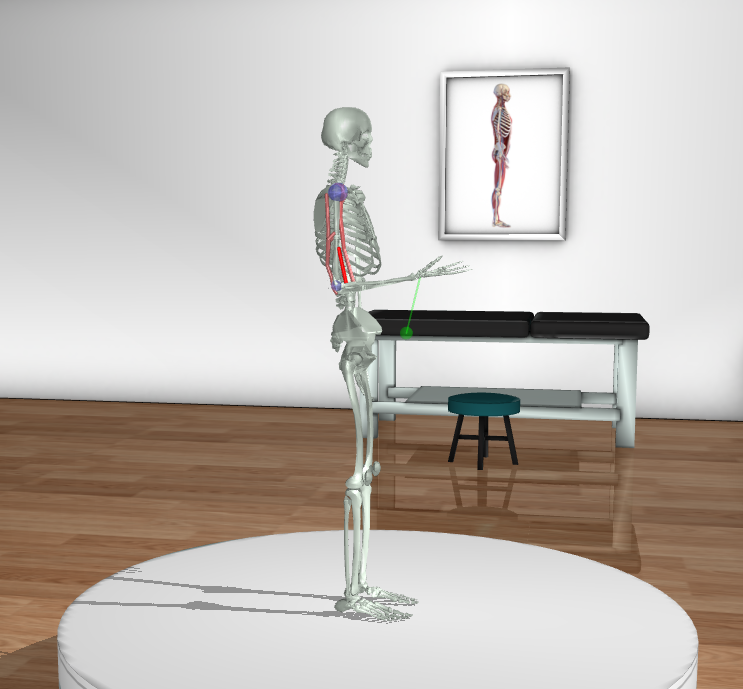

Installation
============

.. _installation:

MyoSuite uses git submodules to resolve dependencies.
Please follow steps exactly as below to install correctly.

Requirements
~~~~~~~~~~~~
* python >= 3.8 (if needed follow instructions `here <https://docs.conda.io/en/latest/miniconda.html>`_ for installing python and conda)
* mujoco >= 2.3.6

Installing the pip package
~~~~~~~~~~~~~~~~~~~~~~~~~~

.. code-block:: bash

   conda create --name MyoSuite python=3.8
   conda activate MyoSuite
   pip install -U myosuite

(alternative) Installing from source
~~~~~~~~~~~~~~~~~~~~~~~~~~~~~~~~~~~~~~~~

To get started with MyoSuite, clone this repo with pre-populated submodule dependencies

.. code-block:: bash

   git clone --recursive https://github.com/facebookresearch/myosuite.git
   cd myosuite
   pip install -e .

Testing the installation
~~~~~~~~~~~~~~~~~~~~~~~~

You can test the installation using

.. code-block:: bash

   python -m myosuite.tests.test_myo

You can visualize the environments with random controls using the below command

.. code-block:: bash

   python -m myosuite.utils.examine_env --env_name myoElbowPose1D6MRandom-v0
   
.. note::
   On MacOS, the need of a launch_passive option might require that the Python script be run under `mjpython` i.e. 
   `mjpython -m myosuite.utils.examine_env --env_name myoElbowPose1D6MRandom-v0`

Examples
~~~~~~~~~

It is possible to create and interface with MyoSuite environments like any other OpenAI gym environments.
For example, to use the ``myoElbowPose1D6MRandom-v0`` environment it is possible simply to run:

.. code-block:: python

   from myosuite.utils import gym
   env = gym.make('myoElbowPose1D6MRandom-v0')
   env.reset()
   for _ in range(1000):
     env.mj_render()
     env.step(env.action_space.sample()) # take a random action
   env.close()

By default it will activate the simulator and the following visualization is expected:

