Models and Tasks
##############################

.. _suite:

Models and tasks are the most important aspects of Myosuite. To provide further, 

* :ref:`models`
    * :ref:`myoFinger`
    * :ref:`myoElbow`
    * :ref:`myoHand`
    * :ref:`myoLeg`
    * :ref:`myoArm`
* :ref:`tasks`
* :ref:`task_and_variations`

.. _models:

Models
********

MyoSuite consists of five models: :ref:`myoFinger`, :ref:`myoElbow`, :ref:`myoHand`, :ref:`myoArm` and :ref:`myoLeg`.
Using these models, we design a rich collection of tasks ranging across simple reaching movements,
contact-rich movements involving object-manipulation such as pen-twirling and baoding balls, as well as locomotion behaviors.

.. _myoFinger:

myoFinger
==========
Simplified and intuitive model (based on Xu et al. (2012)[https://ieeexplore.ieee.org/document/6290710]) of a 4 Degree of Freedom (DoF) finger
which is actuated through a series of 5 simplified antagonistic muscle-tendon units.
We also provide its robotic counterpart with simple torque actuators
to facilitate the comparative investigation.

Details of this model can be found at `myoFinger <https://github.com/MyoHub/myo_sim/tree/main/finger>`__

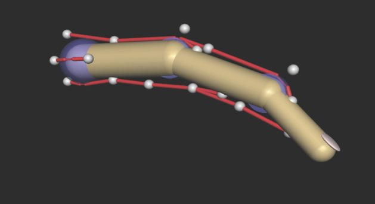

========  =============================
Acronym   Muscle
========  =============================
EXTN      Central Extensor
adabR     Abduction Tendon(Right)
adabL     Abduction Tendon(left)
mflx      Pip Flexor
dflx      DIP Flexor
========  =============================

.. _myoElbow:

myoElbow
===========
A model of 2 DoF human elbow joint -- based on OpenSim’s default testing arm model (Delp et al. (2007); Seth et al. (2018))
-- and actuated using multiple agonist/antagonist pairs (3 flexors and 3 extensors).

Details of this model can be found at `myoElbow <https://github.com/MyoHub/myo_sim/tree/main/elbow>`__

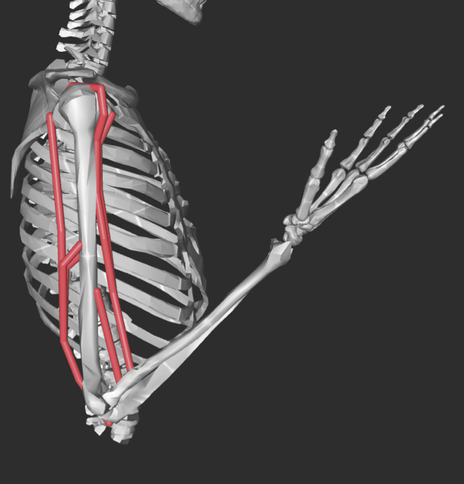

========  ========
Acronym   Muscle
========  ========
TRIlong   Triceps long
TRIlat    Triceps lateral
TRImed    Triceps medial
BIClong   Biceps long
BICshort  Biceps short
BRA       Brachioradialis
========  ========

.. _myoHand:

myoHand
=========
The dexterous human hand requires coordination of multiple highly redundant muscles, which have complementary and antagonistic effects on various joints.
This musculoskeletal model is comprised of 29 bones, 23 joints, and 39 muscles-tendon units.

Details of this model can be found at `myoHand <https://github.com/MyoHub/myo_sim/tree/main/hand>`__

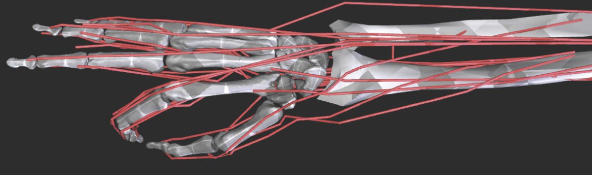

=======  ========
Acronym  Muscle
=======  ========
ECRL     Extensor Carpis Radialis Longus
ECRB     Extensor Carpis Radialis Brevis
ECU      Extensor Carpi Ulnaris
FCR      Flexor Carpi Radialis
FCU      Flexor Carpi Ulnaris
PL       Palmaris longus
PT       Pronator teres
PQ       Pronator
EIP      Extensor Indicis Proprius
EPL      Extensor Pollicis Longus
EPB      Extensor Pollicis Brevis
FPL      Flexor Pollicis Longus
APL      Abductor Pollicis Longus
OP       Opponens Pollicis
FDS      Flexor Digitorum Superficialis (2- index, 3- middle, 4- ring, 5- little)
FDP      Flexor Digitorum Profundus (2- index, 3- middle, 4- ring, 5- little)
EDC      Extensor Digitorum Communis (2- index, 3- middle, 4- ring, 5- little)
EDM      Extensor Digiti Minimi
RI       Radial Interosseous (2- index, 3- middle, 4- ring, 5- little)
LU-RB    Lumbrical (2- index, 3- middle, 4- ring, 5- little)
UI-UB    Palmar or Ulnar Interosseous (2- index, 3- middle, 4- ring, 5- little)
=======  ========

.. _myoLeg:

myoLeg
=========
The 3D dexterous human leg requires coordination of multiple highly redundant muscles, which have complementary and antagonistic effects on various joints.

This musculoskeletal model is comprised of 10 joints, 20 DoFs, and 80 muscles-tendon units. This musculoskeletal model takes
Rajagopal's full body gait model [https://github.com/opensim-org/opensim-models/tree/master/Models/RajagopalModel] as close reference.

Joints and muscle details can be found in Rajagopal's paper [https://ieeexplore.ieee.org/document/7505900]

The model implementation details can be found on our github repo at `myoLeg <https://github.com/MyoHub/myo_sim/tree/main/leg>`__

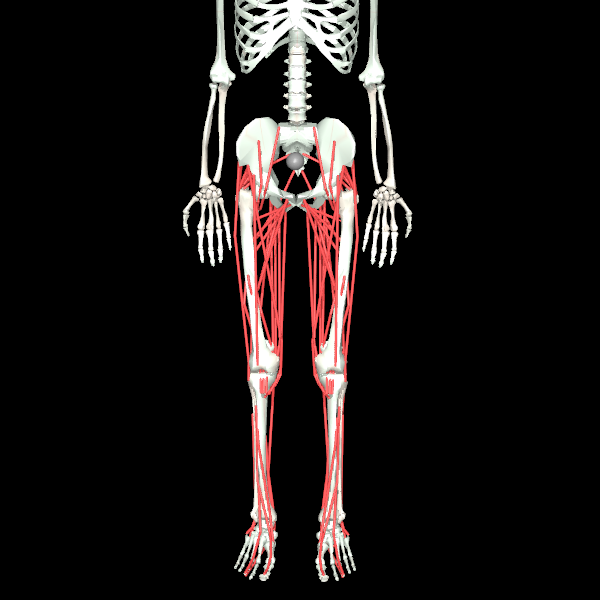

=============   =================================
Acronym         Muscle
=============   =================================
addbrev_r       Adductor brevis
addlong_r       Adductor longus
addmagDist_r    Adductor magnus (distal)
addmagIsch_r    Adductor magnus (ischial)
addmagMid_r     Adductor magnus (middle)
addmagProx_r    Adductor magnus (proximal)
bflh_r          Biceps femoris long head
bfsh_r          Biceps femoris short head
edl_r           Extensor digitorum longusc
ehl_r           Extensor hallucis longusc
fdl_r           Flexor digitorum longus
fhl_r           Flexor hallucis longus
gaslat_r        Gastrocnemius lateral head
gasmed_r        Gastrocnemius medial head
glmax1_r        Gluteus maximus (superior)
glmax2_r        Gluteus maximus (middle)
glmax3_r        Gluteus maximus (inferior)
glmed1_r        Gluteus medius (anterior)
glmed2_r        Gluteus medius (middle)
glmed3_r        Gluteus medius (posterior)
glmin1_r        Gluteus minimus (anterior)
glmin2_r        Gluteus minimus (middle)
glmin3_r        Gluteus minimus (posterior)
grac_r          Gracilis 
iliacus_r       Iliacus
perbrev_r       Peroneus brevis
perlong_r       Peroneus longus
piri_r          Piriformis 
psoas_r         Psoas
recfem_r        Rectus femoris
sart_r          Sartorius
semimem_r       Semimembranosus
semiten_r       Semitendinosus 
soleus_r        Soleus 
tfl_r           Tensor fascia latae
tibant_r        Tibialis anterior 
tibpost_r       Tibialis posterior 
vasint_r        Vastus intermedius
vaslat_r        Vastus lateralis
vasmed_r        Vastus medialis 
=============   =================================

.. _myoArm:

myoArm
=========
The 3D dexterous human arm reaching and manipulation.

This musculoskeletal model is comprised of 27 Degree of Freedom, and 63 muscles-tendon units.

Model specification can be found on our github repo of `myoArm <https://github.com/MyoHub/myo_sim/tree/main/arm>`__

.. image:: images/myoArm.png
  :height: 200

.. _tasks:

Tasks
*******

Finger Joint Pose
=====================

Objective:
    - Strike a joint pose

Variants:
    - **Easy**: Move to a fixed specified joint pose ``myoFingerPoseFixed-v0``
    - **Hard**: Move to randomly selected joint poses ``myoFingerPoseRandom-v0``
    - **More**: Random resets, no resets, dense rewards, sparse rewards

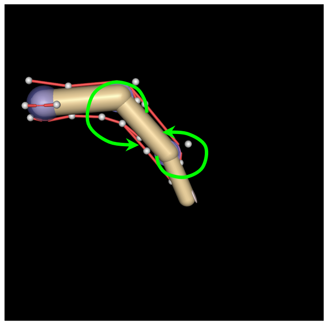

Finger Tip Reach
=====================
Objective:
    - Reach using finger tips

Variants:
    - **Easy**: Reach to a fixed location ``myoFingerReachFixed-v0``
    - **Hard**: Reach to random locations ``myoFingerReachRandom-v0``
    - **More**: Random resets, no resets, dense rewards, sparse rewards

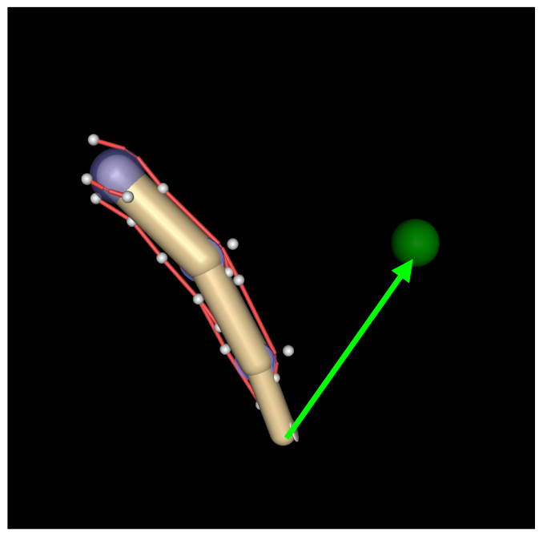

Elbow Joint Pose
=====================
:ref:`myoElbow` model with 6 muscles (3 flexors and 3 extensors) was simplified to have only elbow rotations.
Although it is not a physiologically accurate model it can be a very simple model for troubleshooting initial control schemes.

Objective:
    Move elbow to a specified pose.

Variants:
    - **Easy**: Move to random joint poses using 1 muscle ``ElbowPose1D1MRandom-v0``
    - **Hard**: Move to random joint poses using 6 muscles ``myoElbowPose1D6MRandom-v0``
    - **More**: Random resets, no resets, dense rewards, sparse rewards

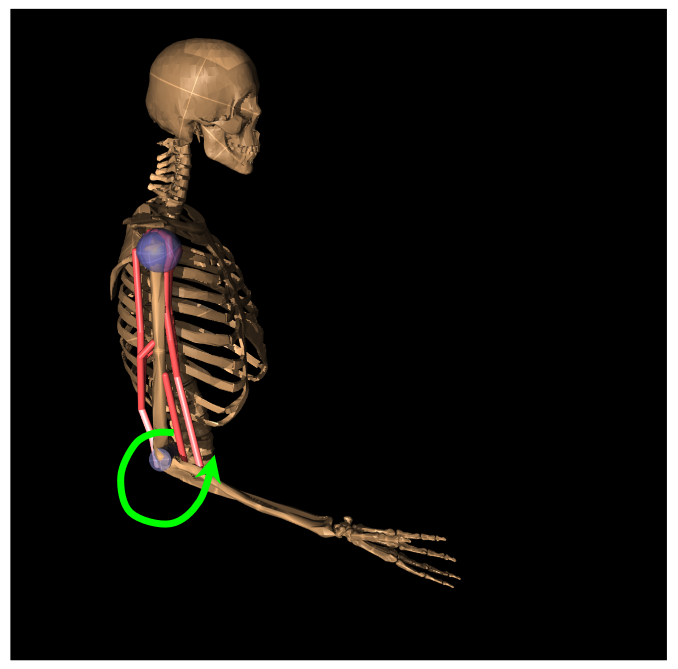

Hand Joints Pose
=====================
Drive the :ref:`myoHand` model to achieve a joint poses.
In addition to making co-ordinated movements, avoiding self collisions poses additional challenges in solving this task.

Objective:
    Strike a hand pose

Variants:
    - **Easy**: Move to a fixed joint pose ``myoHandPoseFixed-v0``
    - **Hard**: Move to a randomly selected joint pose ``myoHandPoseRandom-v0``
    - **More**: Random resets, no resets, dense rewards, sparse rewards

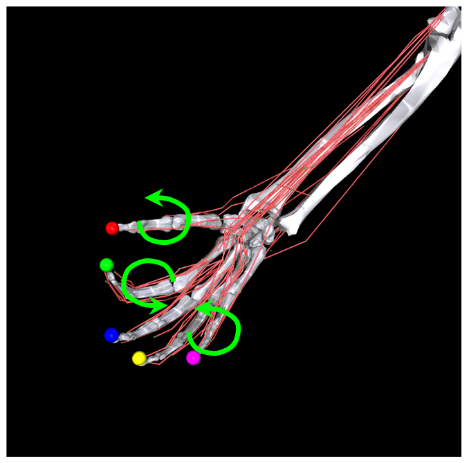

Hand Tips Reach
=====================
Make reaching movements using the :ref:`myoHand` model to have finger tips achieve a specific spatial position.
In addition to making co-ordinated movements, avoiding self collisions poses additional challenges in solving this task.

Objective:
    Reach using finger tips

Variants:
    - **Easy**: Reach fixed positions using finger tips ``myoHandReachFixed-v0``
    - **Hard**: Reach random positions using finger tips ``myoHandReachRandom-v0``
    - **More**: Random resets, no resets, dense rewards, sparse rewards

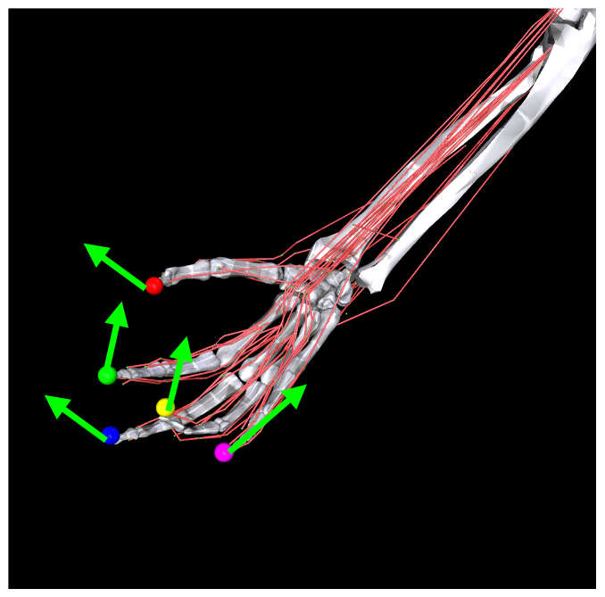

Hand Key Turn
==============
Use the the :ref:`myoHand` model to rotate a key.
The complexity of this task is due to the use of only index and thumb fingers to solve the task with intermittent contact
with the key.

Objective:
    Coordinate finger movements to rotate a key

Variants:
    - **Easy**: Achieve half rotation of the key ``myoHandKeyTurnFixed-v0``
    - **Hard**: Achieve full rotation + random initial configuration ``myoHandKeyTurnRandom-v0``
    - **More**: Random resets, no resets, dense rewards, sparse rewards

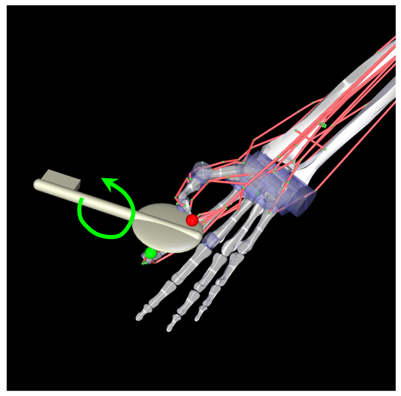

Hand Object Hold
=====================
A :ref:`myoHand` model moves an object in the hand to a given orientation without dropping it.
The complexity of this task is due to the intermittent contacts between the object and multiple fingers needing co-ordination to stabilize the object.

Objective:
    Reposition an object to reach a given target without dropping it.

Variants:
    - **Easy**: Reposition to a fixed position ``myoHandObjHoldFixed-v0``
    - **Hard**: Reposition a random object to random positions ``myoHandObjHoldRandom-v0``
    - **More**: sparse rewards, dense rewards, random resets, reset free

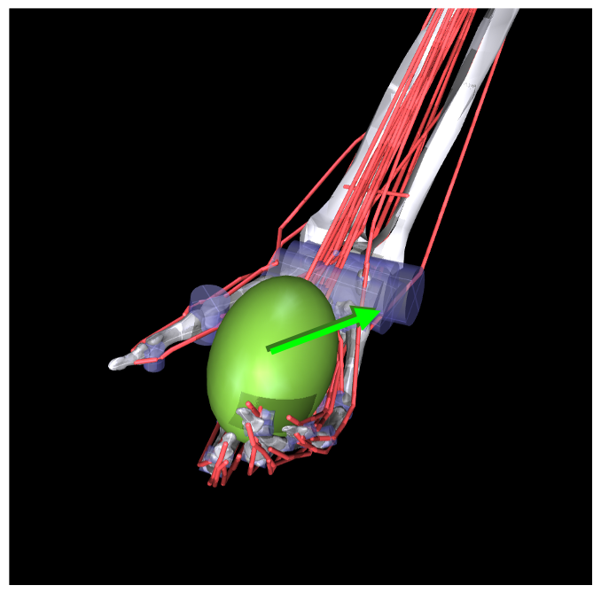

Hand Pen Twirl
==============
A :ref:`myoHand` model rotates a pen in the hand to a given orientation without dropping it.
The complexity of this task is due to the intermittent contacts between the object and multiple fingers while trying to stabilize the object.

Objective:
    Rotate the object to reach a given orientation (indicated by the green object in the scene) without dropping it.

Variants:
    - **Easy**: Rotate to fixed orientation ``myoHandPenTwirlFixed-v0``
    - **Hard**: Rotate of random orientation ``myoHandPenTwirlRandom-v0``
    - **More**: sparse rewards, dense rewards, random resets, reset free

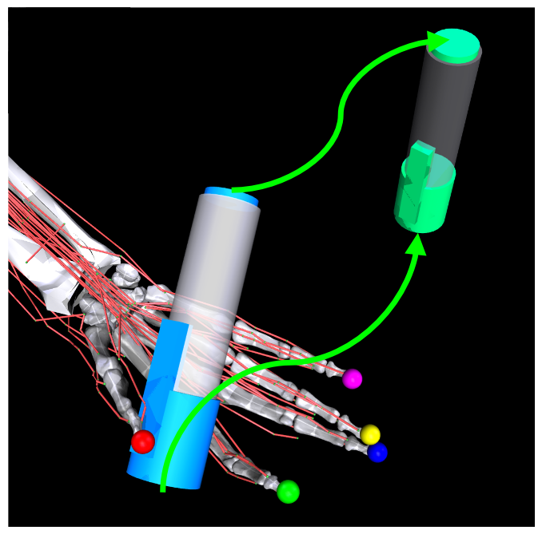

Hand Multiobject Reorientation
======================================
A :ref:`myoHand` model reorients a set of parameterized geometries to a given target orientation without dropping it.
As with before, the complexity of this task is due to the intermittent contacts between the object and multiple fingers while trying to stabilize the object, as well as the multiobject nature of the task.

Objective:
    Rotate one randomly chosen object in the set to reach a given orientation without dropping it.

Variants:
    - **Easiest**: Eight-object reorientation ``myoHandReorient8-v0``
    - **Easy**: 100-object reorientation ``myoHandReorient100-v0``
    - **Hard**: 1000-object orientation (in-domain parameterized geoms) ``myoHandReorientID-v0``
    - **Hardest**: 1000-object orientation (out-of-domain parameterized geoms) ``myoHandReorientOOD-v0``

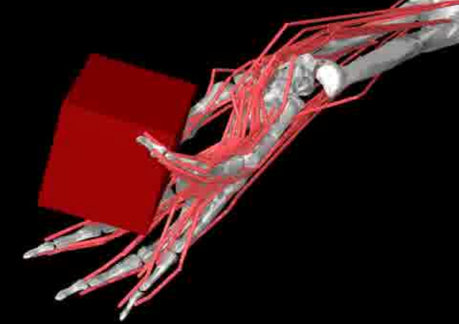

Hand Die Rotation (MyoChallenge 2022)
========================================
A :ref:`myoHand` model involved for reconfiguring a die to match desired goal orientations.
This task require delicate coordination of various muscles to manipulate the die without dropping it.

Objective:
    Rotate the object to reach a given orientation (indicated by the green reference object in the scene) without dropping it.

Action Space:
    The whole set of muscle [0, 1]

Observation Space:
    All joints angles [-:math:`\pi`, :math:`\pi`]

Variants:
    - **Easy**: Goal position and orientation limited ``myoChallengeDieReorientP1-v0``
    - **Hard**: Large range of goal position and rotations. Variability in object size and frictions. ``myoChallengeDieReorientP2-v0``
    - **More**: Sparse rewards, 3 different dense reward options to choose from

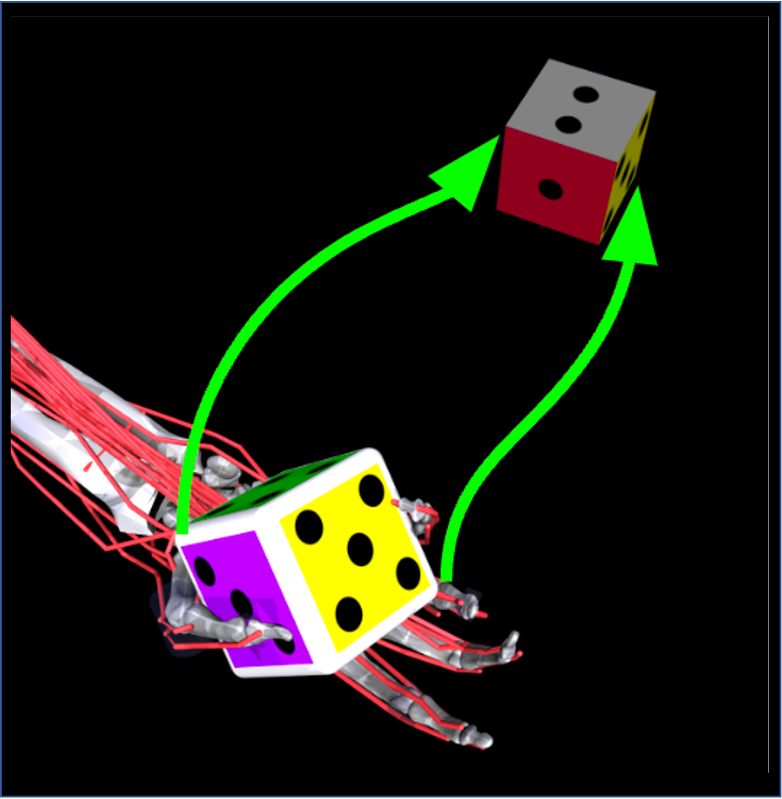

Hand Baoding Balls (MyoChallenge 2022)
========================================
A :ref:`myoHand` model involved for simultaneous rotation of two free-floating spheres over the palm.
This task requires both dexterity and coordination.

Objective:
    Achieve relative rotation of the balls around each other without dropping them.

Action Space:
    The whole set of muscle [0, 1]

Observation Space:
    All joints angles [-:math:`\pi`, :math:`\pi`]

Variants:
    - **Easy**: Swap the position of the balls ``myoChallengeBaodingP1-v1``
    - **Hard**: Large range of goal position and rotations. Variability in object size and frictions. ``myoChallengeBaodingP2-v1``
    - **More**: Sparse rewards, 3 different dense reward options to choose from

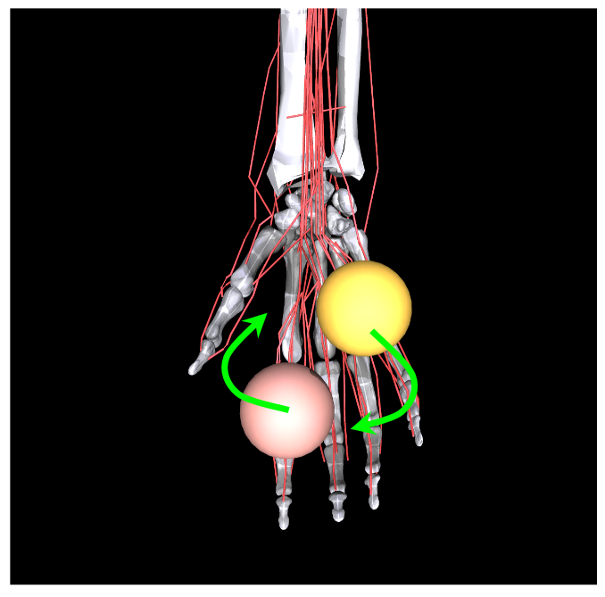

Leg Walk
========================================
A :ref:`myoLeg` model walks across a flat (or rough) surface.
This task requires the control of 80 muscles while stabilizing the body to not fall down.

Objective:
    Achieve target velocities while periodically moving your hip joints.

Variants:
    - **Easy**: Achieve a forward velocity in the y-direction without moving in the x-direction. ``myoLegWalk-v0``
    - **Hard**: Achieve a forward velocity in the y-direction without moving in the x-direction on uneven terrain. ``myoLeg<Rough|Hilly|Stair>Walk-v0``

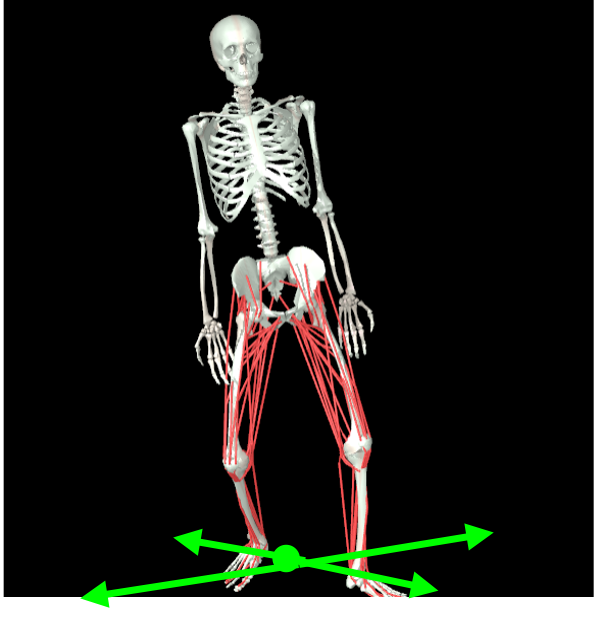

.. Relocate Mobjects
.. ========================================
.. A :ref:`myoArm` model

.. Non-stationarities task variations
.. ***********************************

.. .. _sarcopenia:

.. Sarcopenia
.. ==============

.. Sarcopenia is a muscle disorder that occurs commonly in the elderly population (Cruz-Jentoft and Sayer (2019))
.. and characterized by a reduction in muscle mass or volume.
.. The peak in grip strength can be reduced up to 50% from age 20 to 40 (Dodds et al. (2016)).
.. We modeled sarcopenia for each muscle as a reduction of 50% of its maximal isometric force.

.. .. _fatigue:

.. Fatigue
.. ============================
.. Muscle Fatigue is a short-term (second to minutes) effect that happens after sustained or repetitive voluntary movement
.. and it has been linked to traumas e.g. cumulative trauma disorder (Chaffin et al. (2006)).
.. A dynamic muscle fatigue model (Ma et al. (2009)) was integrated into the modeling framework.
.. This model was based on the idea that different types of muscle fiber that have different contributions
.. and resistance to fatigue (Vøllestad (1997)).
.. The current implementation is simplified to consider the same fatigue factor for all muscles and
.. that muscle can be completely fatigued.

.. .. image:: images/Fatigue.png
..   :width: 800

.. .. _ttransfer:

.. Tendon transfer
.. =================================
.. Contrary to muscle fatigue or sarcopenia that occurs to all muscles, tendon transfer surgery can target a single
.. muscle-tendon unit. Tendon transfer surgery allows redirecting the application point of muscle forces from one joint
.. DoF to another (see below). It can be used to regain functional control of a joint or limb motion after injury.
.. One of the current procedures in the hand is the tendon transfer of Extensor Indicis Proprius (EIP) to replace the
.. Extensor Pollicis Longus (EPL) (Gelb (1995)). Rupture of the EPL can happen after a broken wrist and create a loss of control
.. of the Thumb extension. We introduce a physical tendon transfer where the EIP application point of the tendon was moved
.. from the index to the thumb and the EPL was removed (see Figure 3).

.. .. image:: images/tendon_transfer.png
..   :width: 400

.. .. _exo:

.. Exoskeleton assistance
.. ======================
.. Exoskeleton assisted rehabilitation is becoming more and more common practice (Jezernik et al. (2003)) due to its multiple benefit (Nam et al. (2017)).
.. Modeling of an exoskeleton for the elbow was done via an ideal actuator and the addition of two supports with a weight of 0.101 Kg for the upper arm and 0.111 Kg on the forearm. The assistance given by the exoskeleton was a percentage of the biological joint torque, this was based on the neuromusculoskeletal controller presented in Durandau et al. (2019).

.. .. image:: images/elbow_exo.png
..   :width: 200

.. _task_and_variations:

Task and Variantions
************************************

For convenience, Myosuite has implemented a set of muscle decifiencies that currently includes: :ref:`test_muscle_fatigue` , sarcopenia and tendon transfer alongside with the tasks.

Here are a list of the tasks currently implement in Myosuite. See :ref:`task_variation` on how to include the additional features.

+------------------------+----------------------------------+-----------------+-----------------------+---------------------------+--------------------------------+
|:ref:`tasks`            | **Environment**                  | **Difficulty**  |:ref:`test_sarcopenia` |:ref:`test_muscle_fatigue` | :ref:`test_tendon_transfer`    |
+------------------------+----------------------------------+-----------------+-----------------------+---------------------------+--------------------------------+
| Finger Joint Pose      | ``myoFingerPoseFixed-v0``        | Easy            |         ✓             |      ✓                    |                                |
+------------------------+----------------------------------+-----------------+-----------------------+---------------------------+--------------------------------+
| Finger Joint Pose      | ``myoFingerPoseRandom-v0``       | Hard            |         ✓             |      ✓                    |                                |
+------------------------+----------------------------------+-----------------+-----------------------+---------------------------+--------------------------------+
| Finger Tip Reach       | ``myoFingerReachFixed-v0``       | Easy            |         ✓             |      ✓                    |                                |
+------------------------+----------------------------------+-----------------+-----------------------+---------------------------+--------------------------------+
| Finger Tip Reach       | ``myoFingerReachRandom-v0``      | Hard            |         ✓             |      ✓                    |                                |
+------------------------+----------------------------------+-----------------+-----------------------+---------------------------+--------------------------------+
| Elbow Joint Pose       | ``myoElbowPose1D6MRandom-v0``    | Hard            |         ✓             |      ✓                    |                                |
+------------------------+----------------------------------+-----------------+-----------------------+---------------------------+--------------------------------+
| Hand Joints Pose       | ``myoHandPoseFixed-v0``          | Easy            |         ✓             |      ✓                    |          ✓                     |
+------------------------+----------------------------------+-----------------+-----------------------+---------------------------+--------------------------------+
| Hand Joints Pose       | ``myoHandPoseRandom-v0``         | Hard            |         ✓             |      ✓                    |          ✓                     |
+------------------------+----------------------------------+-----------------+-----------------------+---------------------------+--------------------------------+
| Hand Tips Reach        | ``myoHandReachFixed-v0``         | Easy            |         ✓             |      ✓                    |          ✓                     |
+------------------------+----------------------------------+-----------------+-----------------------+---------------------------+--------------------------------+
| Hand Tips Reach        | ``myoHandReachRandom-v0``        | Hard            |         ✓             |      ✓                    |          ✓                     |
+------------------------+----------------------------------+-----------------+-----------------------+---------------------------+--------------------------------+
| Hand Key Turn          | ``myoHandKeyTurnFixed-v0``       | Easy            |         ✓             |      ✓                    |          ✓                     |
+------------------------+----------------------------------+-----------------+-----------------------+---------------------------+--------------------------------+
| Hand Key Turn          | ``myoHandKeyTurnRandom-v0``      | Hard            |         ✓             |      ✓                    |          ✓                     |
+------------------------+----------------------------------+-----------------+-----------------------+---------------------------+--------------------------------+
| Hand Object Hold       | ``myoHandObjHoldFixed-v0``       | Easy            |         ✓             |      ✓                    |          ✓                     |
+------------------------+----------------------------------+-----------------+-----------------------+---------------------------+--------------------------------+
| Hand Object Hold       | ``myoHandObjHoldRandom-v0``      | Hard            |         ✓             |      ✓                    |          ✓                     |
+------------------------+----------------------------------+-----------------+-----------------------+---------------------------+--------------------------------+
| Hand Pen Twirl         | ``myoHandPenTwirlFixed-v0``      | Easy            |         ✓             |      ✓                    |          ✓                     |
+------------------------+----------------------------------+-----------------+-----------------------+---------------------------+--------------------------------+
| Hand Pen Twirl         | ``myoHandPenTwirlRandom-v0``     | Hard            |         ✓             |      ✓                    |          ✓                     |
+------------------------+----------------------------------+-----------------+-----------------------+---------------------------+--------------------------------+
| Die Rotation           | ``myoChallengeDieReorientP1-v1`` | Easy            |         ✓             |      ✓                    |          ✓                     |
+------------------------+----------------------------------+-----------------+-----------------------+---------------------------+--------------------------------+
| Die Rotation           | ``myoChallengeDieReorientP2-v1`` | Hard            |         ✓             |      ✓                    |          ✓                     |
+------------------------+----------------------------------+-----------------+-----------------------+---------------------------+--------------------------------+
| Hand Baoding Balls     | ``myoChallengeBaodingP1-v1``     | Easy            |         ✓             |      ✓                    |          ✓                     |
+------------------------+----------------------------------+-----------------+-----------------------+---------------------------+--------------------------------+
| Hand Baoding Balls     | ``myoChallengeBaodingP2-v1``     | Hard            |         ✓             |      ✓                    |          ✓                     |
+------------------------+----------------------------------+-----------------+-----------------------+---------------------------+--------------------------------+
| 8 Obj. Rotation        | ``myoHandReorient8-v0``          | Easy            |         ✓             |      ✓                    |          ✓                     |
+------------------------+----------------------------------+-----------------+-----------------------+---------------------------+--------------------------------+
| 100 Obj. Rotation      | ``myoHandReorient100-v0``        | Easy            |         ✓             |      ✓                    |          ✓                     |
+------------------------+----------------------------------+-----------------+-----------------------+---------------------------+--------------------------------+
| 1000 Obj. Rotation     | ``myoHandReorientID-v0``         | Hard            |         ✓             |      ✓                    |          ✓                     |
+------------------------+----------------------------------+-----------------+-----------------------+---------------------------+--------------------------------+
| 1000 Obj. Rotation     | ``myoHandReorientOOD-v0``        | Hard            |         ✓             |      ✓                    |          ✓                     |
+------------------------+----------------------------------+-----------------+-----------------------+---------------------------+--------------------------------+
| Leg walk               | ``myoLegWalk-v0``                | Easy            |         ✓             |      ✓                    |                                |
+------------------------+----------------------------------+-----------------+-----------------------+---------------------------+--------------------------------+
| Leg walk Rough Ground  | ``myoLegRoughTerrainWalk-v0``    | Hard            |         ✓             |      ✓                    |                                |
+------------------------+----------------------------------+-----------------+-----------------------+---------------------------+--------------------------------+
| Leg walk Hilly Ground  | ``myoLegHillyTerrainWalk-v0``    | Hard            |         ✓             |      ✓                    |                                |
+------------------------+----------------------------------+-----------------+-----------------------+---------------------------+--------------------------------+
| Leg walk Stair Ground  | ``myoLegStairTerrainWalk-v0``    | Hard            |         ✓             |      ✓                    |                                |
+------------------------+----------------------------------+-----------------+-----------------------+---------------------------+--------------------------------+
| Grasping & Placing     | ``myoChallengeRelocateP1-v0``    | Easy            |         ✓             |      ✓                    |                                |
+------------------------+----------------------------------+-----------------+-----------------------+---------------------------+--------------------------------+
| Chase Tag              | ``myoChallengeChaseTagP1-v0``    | Easy            |         ✓             |      ✓                    |                                |
+------------------------+----------------------------------+-----------------+-----------------------+---------------------------+--------------------------------+

.. _task_variation:

Variations
  - **Sarcopenia**: myoSarc<Environment> e.g. myoSarcHandPoseFixed-v0
  - **Fatigue**: myoFati<Environment> e.g. myoFatiElbowPose1D6MRandom-v0
  - **TTransfer / Reafferentation**: myoReaf<Environment> e.g. myoReafHandPoseFixed-v0
