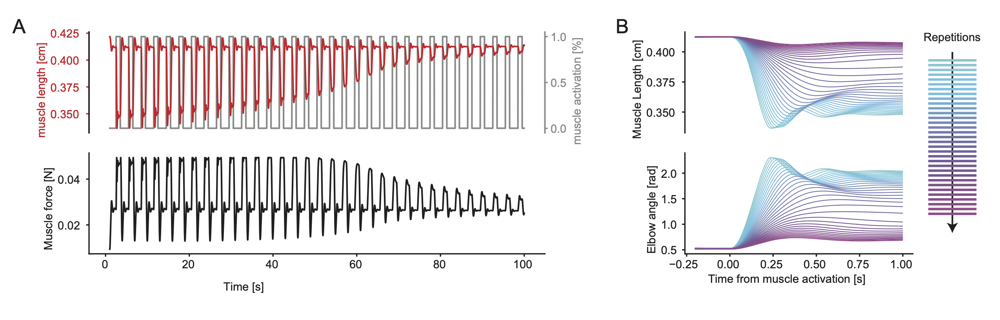
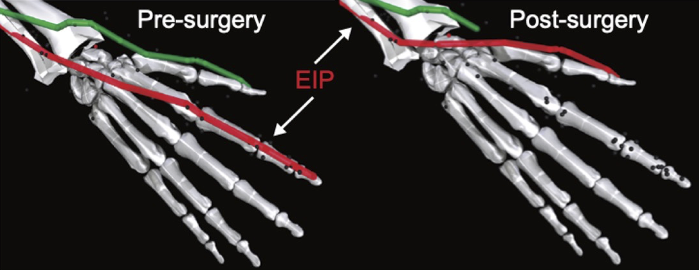
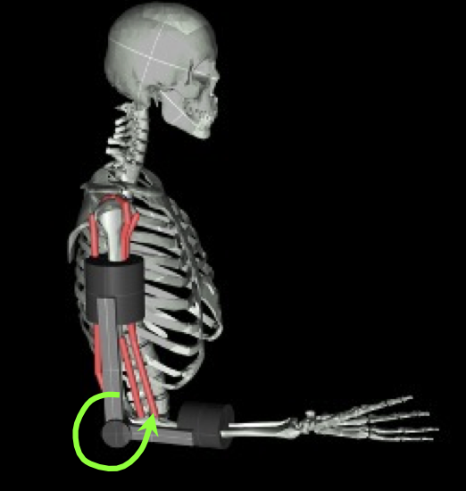

.. _tutorials:

Tutorials
######################

Here a set of examples on how to use different MyoSuite models and non-stationarities.

It is highly recommended to read through the `OpenAI Gym API <https://gymnasium.farama.org/>`__ to get familiar with the Gym API

* :ref:`run_myosuite`
* :ref:`run_visualize_index_movements`
* :ref:`run_trained_policy`
* :ref:`advanced_muscle_conditions`
    * :ref:`test_muscle_fatigue`
    * :ref:`test_sarcopenia`
    * :ref:`test_tendon_transfer`
    * :ref:`exoskeleton`
* :ref:`use_reinforcement_learning`
    * :ref:`resume_training`
    * :ref:`load_deprl_baseline`
    * :ref:`load_MyoReflex_baseline`
* :ref:`customizing_tasks`

.. _jupyter_notebook:

Tutorials on Jupyter-Notebook
========================================
Please refer to our tutorials on the key functionalities, such as model usage and examples of using RL on Jupyter-Notebook `here <https://github.com/facebookresearch/myosuite/tree/main/docs/source/tutorials>`__

There are also tutorials for our ICRA workshops: `ICRA-2023 <https://colab.research.google.com/drive/1zFuNLsrmx42vT4oV8RbnEWtkSJ1xajEo>`__ (example of running a simple myosuite environment)
, `ICRA-2024 <https://colab.research.google.com/drive/1JwxE7o6Z3bqCT4ewELacJ-Z1SV8xFhKK#scrollTo=QDppGIzHB9Zu>`__ (example of hand object manipulation)

.. _run_myosuite:

Test Environment
======================
Example on how to use an environment e.g. send random movements

.. code-block:: python

    from myosuite.utils import gym
    env = gym.make('myoElbowPose1D6MRandom-v0')
    env.reset()
    for _ in range(1000):
        env.mj_render()
        env.step(env.action_space.sample()) # take a random action
    env.close()

.. _run_visualize_index_movements:

Activate and visualize finger movements
============================================
Example on how to generate and visualize a movement e.g. index flexion, and visualize the results

.. code-block:: python

    from myosuite.utils import gym
    env = gym.make('myoHandPoseRandom-v0')
    env.reset()
    for _ in range(1000):
        env.mj_render()
        env.step(env.action_space.sample()) # take a random action
    env.close()

.. _run_trained_policy:

Test trained policy
======================
Example on using a policy e.g. elbow flexion, and change non-stationaries

.. code-block:: python

    from myosuite.utils import gym
    policy = "iterations/best_policy.pickle"

    import pickle
    pi = pickle.load(open(policy, 'rb'))

    env = gym.make('myoElbowPose1D6MRandom-v0')
    env.reset()
    for _ in range(1000):
        env.mj_render()
        env.step(env.action_space.sample()) # take a random action

.. _advanced_muscle_conditions:

Advanced Muscle Conditions
=========================================

Besides from the simulation of healthy muscle conditions, Myosuite also provides features to simulate a number of muscle deficiencies. We aim provides a safe and trust-worthy environment for healthcare or rehabilitation strategies development leveraging the help of a simulator.

.. _test_muscle_fatigue:

Muscle Fatigue
+++++++++++++++++++++++++++++++++++++
Muscle Fatigue is a short-term (second to minutes) effect that happens after sustained or repetitive voluntary movement
and it has been linked to traumas e.g. cumulative trauma disorder (Chaffin et al. (2006)).
A dynamic muscle fatigue model (`Cheema et al. (2020) <https://dl.acm.org/doi/pdf/10.1145/3313831.3376701>`__) was integrated into the modeling framework.
This model was based on the idea that different types of muscle fiber that have different contributions
and resistance to fatigue (Vøllestad (1997)).
The current implementation is simplified to consider the same fatigue factor for all muscles and
that muscle can be completely fatigued.

This example shows how to add fatigue to a model. The muscle force will gradually decrease as a result of repeated actions. It tests random actions on a model without and then with muscle fatigue.

.. code-block:: python

    from myosuite.utils import gym
    env = gym.make('myoElbowPose1D6MRandom-v0')
    env.reset()
    for _ in range(1000):
        env.mj_render()
        env.step(env.action_space.sample()) # take a random action

    # Add muscle fatigue
    env = gym.make('myoFatiElbowPose1D6MRandom-v0')
    env.reset()
    for _ in range(1000):
        env.mj_render()
        env.step(env.action_space.sample()) # take a random action
    env.close()

More advanced examples as well as detailed explanations can be found in `this tutorial<https://github.com/MyoHub/myosuite/tree/main/docs/source/tutorials/7_Fatigue_Modeling.ipynb>`.

.. _test_sarcopenia:

Sarcopenia
+++++++++++++++++++++++++++++++++++++

Sarcopenia is a muscle disorder that occurs commonly in the elderly population (Cruz-Jentoft and Sayer (2019))
and characterized by a reduction in muscle mass or volume.
The peak in grip strength can be reduced up to 50% from age 20 to 40 (Dodds et al. (2016)).
We modeled sarcopenia for each muscle as a reduction of 50% of its maximal isometric force.

This example shows how to add sarcopenia or muscle weakness to a model. The maximum muscle force will be reduced. It tests random actions on a model without and then with muscle weakness.

.. code-block:: python

    from myosuite.utils import gym
    env = gym.make('myoElbowPose1D6MRandom-v0')
    env.reset()
    for _ in range(1000):
        env.mj_render()
        env.step(env.action_space.sample()) # take a random action

    # Add muscle weakness
    env = gym.make('myoSarcElbowPose1D6MRandom-v0')
    env.reset()
    for _ in range(1000):
        env.mj_render()
        env.step(env.action_space.sample()) # take a random action
    env.close()

.. _test_tendon_transfer:

Physical tendon transfer
+++++++++++++++++++++++++++++++++++++
Contrary to muscle fatigue or sarcopenia that occurs to all muscles, tendon transfer surgery can target a single
muscle-tendon unit. Tendon transfer surgery allows redirecting the application point of muscle forces from one joint
DoF to another (see below). It can be used to regain functional control of a joint or limb motion after injury.
One of the current procedures in the hand is the tendon transfer of Extensor Indicis Proprius (EIP) to replace the
Extensor Pollicis Longus (EPL) (Gelb (1995)). Rupture of the EPL can happen after a broken wrist and create a loss of control
of the Thumb extension. We introduce a physical tendon transfer where the EIP application point of the tendon was moved
from the index to the thumb and the EPL was removed.

This example shows how load a model with physical tendon transfer. This simulates a redirected muscle actuations

.. code-block:: python

    from myosuite.utils import gym
    env = gym.make('myoHandKeyTurnFixed-v0')
    env.reset()
    for _ in range(1000):
        env.mj_render()
        env.step(env.action_space.sample()) # take a random action

    # Add tendon transfer
    env = gym.make('myoTTHandKeyTurnFixed-v0')
    env.reset()
    for _ in range(1000):
        env.mj_render()
        env.step(env.action_space.sample()) # take a random action
    env.close()

.. _exoskeleton:

Exoskeleton assistance
+++++++++++++++++++++++++++++++++++++
Exoskeleton assisted rehabilitation is becoming more and more common practice (Jezernik et al. (2003)) due to its multiple benefit (Nam et al. (2017)).
Modeling of an exoskeleton for the elbow was done via an ideal actuator and the addition of two supports with a weight of 0.101 Kg for the upper arm and 0.111 Kg on the forearm. The assistance given by the exoskeleton was a percentage of the biological joint torque, this was based on the neuromusculoskeletal controller presented in Durandau et al. (2019).

The models and code will be released soon.

.. _use_reinforcement_learning:

Using Reinforcement Learning
=============================================
Myosuite provdies features to support RL training. Here are examples of using different RL libraries on Myosuite. 

.. _resume_training:

Resume Learning of policies
+++++++++++++++++++++++++++++++++++++
When using ``mjrl`` it might be needed to resume training of a policy locally. It is possible to use the following instruction

.. code-block:: bash

    python3 hydra_mjrl_launcher.py --config-path config --config-name hydra_biomechanics_config.yaml hydra/output=local hydra/launcher=local env=myoHandPoseRandom-v0 job_name=[Absolute Path of the policy] rl_num_iter=[New Total number of iterations]

.. _load_deprl_baseline:

Load DEP-RL Baseline
+++++++++++++++++++++++++++++++++++++
See `here <https://deprl.readthedocs.io/en/latest/index.html>`__ for more detailed documentation of ``deprl``.

.. note::
    Deprl requires Python `3.9` or newer.

If you want to load and execute the pre-trained DEP-RL baseline. Make sure that the ``deprl`` package is installed.

.. code-block:: python

    from myosuite.utils import gym
    import deprl
    from deprl import env_wrappers

    # we can pass arguments to the environments here
    env = gym.make('myoLegWalk-v0', reset_type='random')
    env = env_wrappers.GymWrapper(env)
    policy = deprl.load_baseline(env)
    obs = env.reset()
    for i in range(1000):
        env.mj_render()
        action = policy(obs)
        obs, *_ = env.step(action)
    env.close()

.. _load_MyoReflex_baseline:

Load MyoReflex Baseline
+++++++++++++++++++++++++++++++++++++

To load and execute the MyoReflex controller with baseline parameters.
Run the MyoReflex tutorial `here <https://github.com/facebookresearch/myosuite/tree/main/docs/source/tutorials/4b_reflex>`__

.. _customizing_tasks:

Customizing Tasks
======================

In order to create a new customized task, there are two places where you need to act:

1. Set up a new environment class for the new task

2. Register the new task

Set up a new environment
+++++++++++++++++++++++++

Environment classes are developed according to the `OpenAI Gym definition <https://gymnasium.farama.org/api/env/>`__
and contain all the information specific for a task,
to interact with the environment, to observe it and to
act on it. In addition, each environment class contains
a reward function which converts the observation into a
number that establishes how good the observation is with
respect to the task objectives. In order to create a new
task, a new environment class needs to be generated eg.
reach2_v0.py (see for example how `reach_v0.py <https://github.com/MyoHub/myosuite/blob/main/myosuite/envs/myo/myobase/reach_v0.py>`__ is structured).
In this file, it is possible to specify the type of observation (eg. joint angles, velocities, forces), actions (e.g. muscle, motors), goal, and reward.

.. code-block:: python

    from myosuite.envs.myo.base_v0 import BaseV0

    # Class extends Basev0
    class NewReachEnvV0(BaseV0):
        ....

    # defines the observation
    def get_obs_dict(self, sim):
        ....

    # defines the rewards
    def get_reward_dict(self, obs_dict):
        ...

    #reset condition that
    def reset(self):
        ...

.. _setup_base_class:

Register the new environment
++++++++++++++++++++++++++++++

Once defined the task `reach2_v0.py`, the new environment needs to be registered to be
visible when importing `myosuite`. This is achieved by introducing the new environment in
the `__init__.py` (called when the library is imported) where the registration routine happens.
The registration of the new enviornment is obtained adding:

.. code-block:: python

    from gym.envs.registration import register

    register(id='newReachTask-v0',
        entry_point='myosuite.envs.myo.myobase.reach_v0:NewReachEnvV0', # where to find the new Environment Class
        max_episode_steps=200, # duration of the episode
        kwargs={
            'model_path': curr_dir+'/../assets/hand/myohand_pose.xml', # where the xml file of the environment is located
            'target_reach_range': {'IFtip': ((0.1, 0.05, 0.20), (0.2, 0.05, 0.20)),}, # this is used in the setup to define the goal e.g. rando position of the team between 0.1 and 0.2 in the x coordinates
            'normalize_act': True, # if to use normalized actions using a sigmoid function.
            'frame_skip': 5, # collect a sample every 5 iteration step
        }
    )

.. _register_new_environment:

