# Task Snapshots

Representative renders for the **MyoChallenge catalog** registered in this
repo, plus the elbow / leg-walk / directional tasks from the recent locomotion
effort. This is **not** the full 200+ env MyoSuite catalog — see
`myosuite/envs/myo/tasks/` for the complete registry.

One image per task family. P1/P2/eval variants share a scene unless noted;
`myoSarc*` / `myoFati*` muscle-condition aliases are not snapshotted separately.
Free-object tasks (die, baoding, relocate, bimanual, table tennis) are
the **reset frame** — a zero-action rollout drops the object. Locomotion
frames are a short zero-action settle where that still shows the scene.

Images live in `docs/task_snapshots/`. All obs/action dims and muscle counts
below were read directly off `gym.make(env_id)` (`model.na` = muscle actuators,
`model.nu` = total actuators including prosthetic / robotic ones).

**mjlab GPU** is registered only for `myoChallengeTableTennisP{0,1,2}-v0`.
Every other challenge ID below is CPU-only.

---

## myoElbowPose1D6MFixed-v0

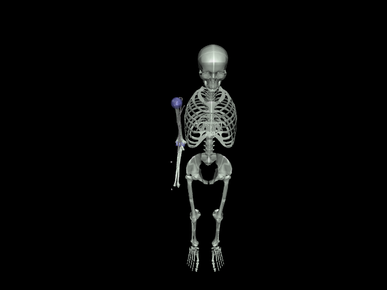

- **MSK model**: 6-muscle 1-DOF elbow (`myoElbowPose1D6M`), 29 bodies.
- **Task**: drive `r_elbow_flex` to a **fixed target of 2.0 rad** (`ElbowPoseFixedTask`
  in `myosuite/envs/myo/tasks/basic/specs/elbow_pose_spec.py`). Purely a pose-tracking
  reward against the target joint angle shown as the sphere in the image.
- **Dims**: obs `(9,)`, action `(6,)`, `na=6`, `nu=6`.
- **Backends**: CPU (`ModularTaskEnv`, experimental route per repo convention) +
  mjlab GPU registration in `register_mjlab_tasks.py`.
- **Status**: stable reference task, not touched by this session's bug fixes.

---

## myoLegWalk-v0

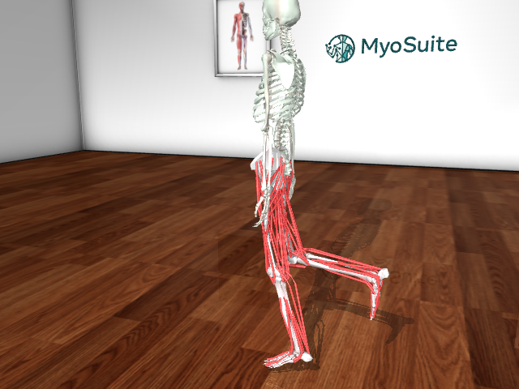

- **MSK model**: `myolegs_with_torso` — 80-muscle bipedal leg+torso model, 16 bodies.
- **Task**: forward walking. `LegWalkEnvV0.get_reward_dict` uses the shared
  `walk_env_reward` term, dominated by `vel_reward` (weight 5.0) — forward CoM
  velocity tracking, with `solved` when `vel_reward >= 1.0`.
- **Dims**: obs `(403,)`, action `(80,)`, `na=80`, `nu=80`.
- **Backends**: CPU `MyoGymnasiumEnv` + mjlab GPU (`register_mjlab_tasks.py`).
- **Status**: this session fixed a GPU reset bug (root literally spawning at the
  world origin — same bug class as the directional envs, see `fe86695f`). **Known
  open issue**: the render above still shows an unnamed gray pedestal/cylinder
  geom (~1.05 m radius) under the character on both CPU and GPU — a separate,
  still-open visual bug another agent is investigating in parallel; not fixed
  as part of this doc pass.

---

## myoLegDirectionalForward-v0 / Backward / Random

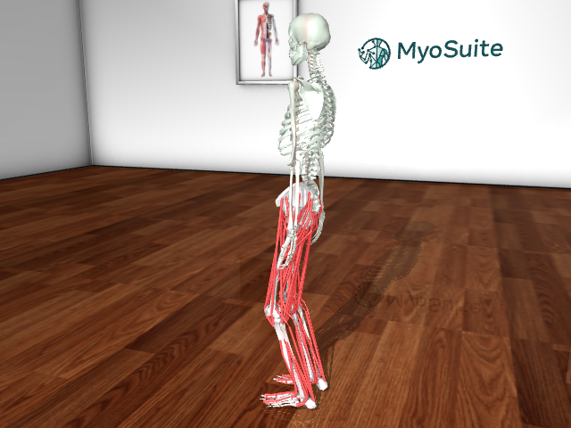

- **MSK model**: same `myolegs_with_torso`, 80 muscles, 16 bodies, as `myoLegWalk-v0`.
- **Task**: track a commanded planar heading + speed (`myosuite/envs/myo/tasks/basic/leg/specs/leg_directional_spec.py`).
  Reward = `1.0 * heading + 0.1 * act_reg`, where `heading` rewards CoM velocity
  along `heading_dir` at `target_speed`.
  - **Forward**: `heading_dir=(0, 1)`, `target_speed=1.2 m/s`, fixed per episode.
  - **Backward**: `heading_dir=(0, -1)`, `target_speed=1.0 m/s`, fixed per episode.
  - **Random**: samples a fresh heading from the full unit circle every reset
    (`randomize_heading=True`); the obs includes `heading_cmd` so the policy must
    learn the command→direction mapping instead of memorizing one direction.
- **Dims**: obs `(153,)`, action `(80,)`, `na=80`, `nu=80` (all three variants).
- **Backends**: CPU (`ModularTaskEnv`) + mjlab GPU, registered per-variant in
  `register_mjlab_tasks.py`.
- **Status**: reset-pose bug (zero-qpos collapse on CPU, missing `InitialStateCfg`
  application on GPU) fixed and committed this session. A 400-iteration GPU smoke
  test on `myoLegDirectionalRandom-v0` confirmed clean convergence once
  `episode_length_s` was bumped 5.0→20.0 to match `myoLegWalk-v0`'s horizon; a full
  2h GPU run was in progress as of this writing. Same pedestal-geom visual artifact
  as `myoLegWalk-v0` is visible in the render above (open, tracked separately).

---

# MyoChallenge 2022 — physiological dexterity (hand)

## myoChallengeDieReorientDemo-v0 / P1 / P2

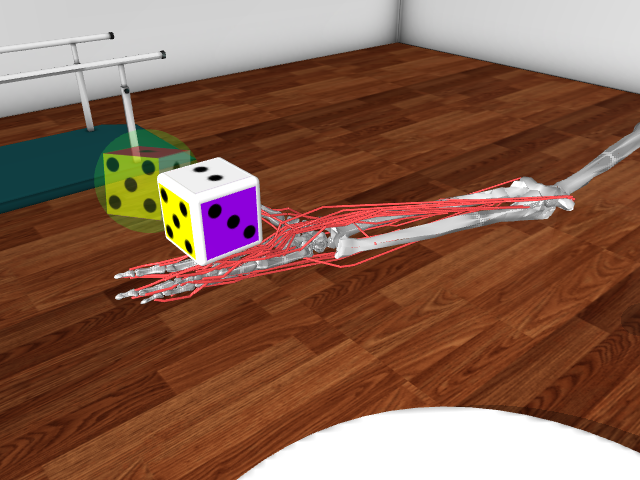

- **MSK model**: `myohand_die` — 39-muscle MyoHand, 41 bodies. Snapshot is
  **reset frame** (free die falls under zero-action steps).
- **Task**: reorient the colored die so its pose matches the translucent
  green-sphere goal (`ReorientEnv`). Reward is dominated by `pos_dist` (100) and
  `rot_dist` (1).
  - **Demo**: ignore position error (`pos_th=inf`), goal at origin, rotation
    `±45°`.
  - **P1**: goal position `±1 cm`, rotation `±90°`.
  - **P2**: goal position `±2 cm`, rotation `±180°`, plus die size/mass/friction
    randomization.
- **Dims** (P1): obs `(102,)`, action `(39,)`, `na=39`, `nu=39`.
- **Backends**: CPU only.

---

## myoChallengeBaodingP1-v1 / P2

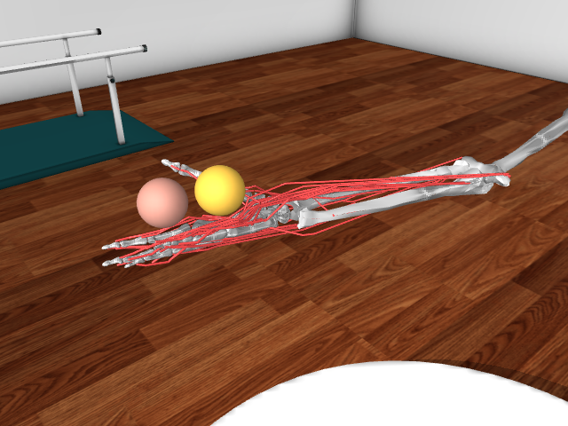

- **MSK model**: `myohand_baoding` — 39-muscle MyoHand, 41 bodies. Snapshot is
  **reset frame** (free balls fall under zero-action steps).
- **Task**: rotate two baoding balls in the palm (`BaodingEnv`, default
  `BAODING_CCW`).
  - **P1**: fixed 5 s period, fixed orbit radii.
  - **P2**: period 4–6 s, randomized orbit, ball size/mass/friction, and
    `task_choice="random"` (hold / CW / CCW).
- **Dims** (P1): obs `(86,)`, action `(39,)`, `na=39`, `nu=39`.
- **Backends**: CPU only.

---

# MyoChallenge 2023 — dexterity and agility

## myoChallengeRelocateP1-v0 / P2 / P2eval

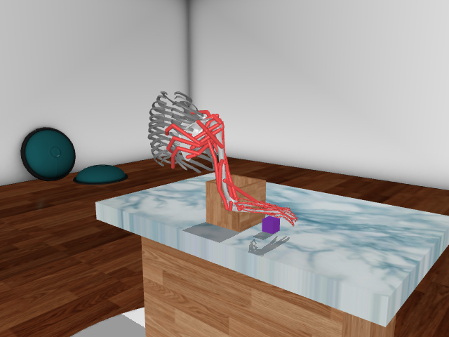

- **MSK model**: `myoarm_relocate` — 63-muscle arm+hand, 42 bodies. Snapshot is
  **reset frame**. The thorax is a single visual ribcage geom on the massless
  `thorax_stub` body, not an articulated torso: the arm chain starts at
  `clavicle_r`, so there are no thoracic/lumbar DOFs (matching the public task,
  whose body is likewise a static mesh).
- **Task**: pick up the object and place it in the wooden receptacle
  (`RelocateEnv`). Success uses `pos_th=0.1` (cover the base) and ignores
  rotation (`rot_th=inf`).
  - **P1**: fixed object, target on the table plane.
  - **P2**: joint-init noise, target/object pose ranges, geom size, mass,
    friction.
  - **P2eval**: wider ranges than P2 (eval split).
- **Dims** (P1): obs `(156,)`, action `(63,)`, `na=63`, `nu=63`.
- **Backends**: CPU only.

---

## myoChallengeChaseTagP1-v0 / P2 / P2eval

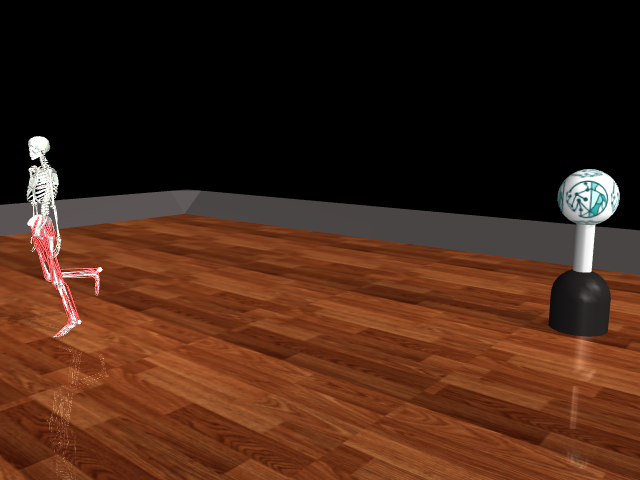

- **MSK model**: `myolegs_chasetag` — 80-muscle biped, 18 bodies. The 2023
  opponent is a **primitive** (MyoSuite-logo sphere on a stand), not a second
  myoLeg — contrast with `myoChallengeChaseTagFBVs-v0` below.
- **Task**: chase or evade the scripted opponent (`ChaseTagEnv`, win distance
  0.5 m).
  - **P1**: flat terrain, `task_choice="CHASE"`, `reset_type="init"`.
  - **P2**: random terrain (hills/rough/relief), random chase/evade role.
  - **P2eval**: adds a repeller opponent policy and a fourth mixture weight.
- **Dims** (P1): obs `(393,)`, action `(80,)`, `na=80`, `nu=80`.
- **Backends**: CPU only.

---

# MyoChallenge 2024 — enhanced humans (OSL)

## myoChallengeOslRunFixed-v0 / Random

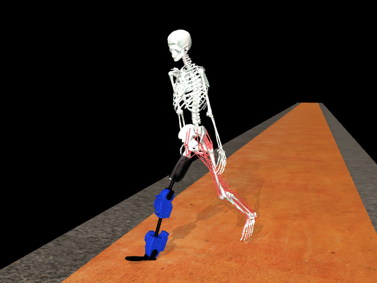

- **MSK model**: `myoosl_runtrack` — biological left leg + Open Source Leg
  prosthesis on the right. The agent commands 54 biological muscles; the two
  extra actuators (`nu=56`) are driven by `MyoOSLController`, not the policy.
- **Task**: run the orange track (`RunTrackEnv`).
  - **Fixed**: flat terrain, `start_pos=14`, `end_pos=-15`, 1000-step episodes.
  - **Random**: mixed hills/rough/stairs, `start_pos=58`, `end_pos=-45`, 60k-step
    episodes.
- **Dims** (Fixed): obs `(260,)`, action `(54,)`, `na=54`, `nu=56`, 18 bodies.
- **Backends**: CPU only.
- **Known visual**: the pelvis uses OSL `quat="0.707107 0.707107 0 0"` (not the
  `myolegs_chain` OpenSim frame). The waist twist in the render is that host
  convention — do **not** apply the directional-task torso yaw here.

---

# MyoChallenge 2025 — soccer, table tennis, bimanual

## myoChallengeSoccerP1-v0 / P2

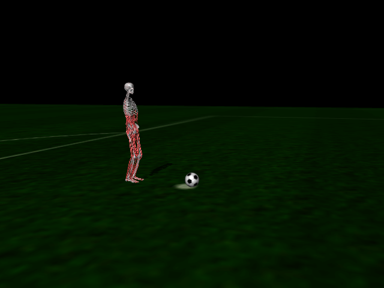

- **MSK model**: `myolegs_soccer` — 290-muscle full-body kicker, 32 bodies
  (includes soccer-only `torso_mount`). The goalkeeper is a scripted primitive
  (logo sphere on a stand at `x=50`).
- **Task**: shoot past the keeper (`SoccerEnv`).
  - **P1**: `reset_type="none"`, always-stationary keeper
    `goalkeeper_probabilities=(0, 0, 1)`.
  - **P2**: random reset, mixed keeper policies `(0.1, 0.3, 0.6)`, 10 s cap.
- **Dims** (P1): obs `(1273,)`, action `(290,)`, `na=290`, `nu=290`.
- **Backends**: CPU only.
- **Known visual**: the real public competition XML (verified against commit
  `8b6635b7~1`) has the torso facing the goal (+X) while the pelvis faces
  −Y — a ~90° torso/pelvis mismatch baked into that asset itself (its frozen
  local torso used `sacrum quat="0.707 0.707 0 0"`, a different convention
  than the pelvis). Deliberately **not** replicated here: torso and pelvis
  are aligned instead (both −Y), since `myotorso_chain.xml`'s sacrum euler
  is bit-identical to `myolegs_chain.xml`'s pelvis euler and composes with
  no rotation needed. See `tasks/lessons.md` for the full comparison.

---

## myoChallengeTableTennisP0-v0 / P1 / P2

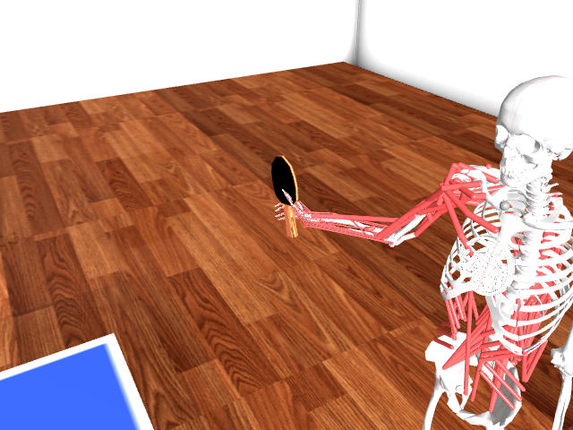

- **MSK model**: `myoarm_tabletennis` — bimanual arm (both arms mirrored/attached),
  273 muscles, 107 bodies, in a table-tennis room scene (table, net, robot ball
  launcher visible in the render).
- **Task**: rally a served ping-pong ball back over the net (`TableTennisEnv` in
  `tabletennis.py`). Dense reward combines `reach_dist`/`palm_dist`/`paddle_quat`
  exponential tracking terms, `torso_up` posture, `act_reg`, and a `sparse`
  paddle-contact bonus; `solved` (successful return) relaunches the ball up to
  `rally_count` times per episode.
  - **P0**: baseline — ball spawn range unset (env default).
  - **P1**: narrower `ball_xyz_range` (tighter serve window: `x∈[-1.25,-1.20]`,
    `y∈[-0.5,-0.45]`, `z∈[1.4,1.5]`) — an easier, more repeatable serve.
  - **P2**: adds `ball_qvel` (nonzero serve velocity), `paddle_mass_range`
    randomization, disables `qpos_noise_range`, and widens `ball_xyz_range` — a
    harder, more randomized variant.
- **Dims**: obs `(417,)`, action `(275,)`, `na=273`, `nu=275` (all three P-variants
  identical in dimensionality; they differ only in the kwargs above).
- **Backends**: CPU + mjlab GPU, all three P-variants registered in
  `register_mjlab_tabletennis.py`.
- **Status**: reset state now matches public `myoarm_tabletennis.xml` numerically
  — paddle body pose, compiled geom transform and world mesh AABB all diff to
  0.0 m / 0.00°, and the public keyframe arm pose already puts the handle inside
  `S_grasp` (16 mm), so no reset-time snapping is needed or performed. The
  earlier "paddle in the wrong place" was the **actor**: `pelvis_x`/`pelvis_y`
  are slide joints on the calibrated root body, whose yaw differs from legacy's
  `euler="0 0 3.14"`, so the keyframe's `pelvis_x=-0.4205` drove the skeleton
  0.59 m sideways instead of forward and left the paddle out of reach. Also
  fixed in the recipe: legacy `<inertial>` / zero-mass collision geoms (the ball
  was 5 kg, the paddle 1.5 kg), the ground plane sunk to z=−0.4, and the 1280×1080
  offscreen buffer. Snapshot is the **reset frame** — zero-action steps drop the
  un-welded paddle out of the relaxed hand, in the public env too.

---

## myoChallengeBimanual-v0

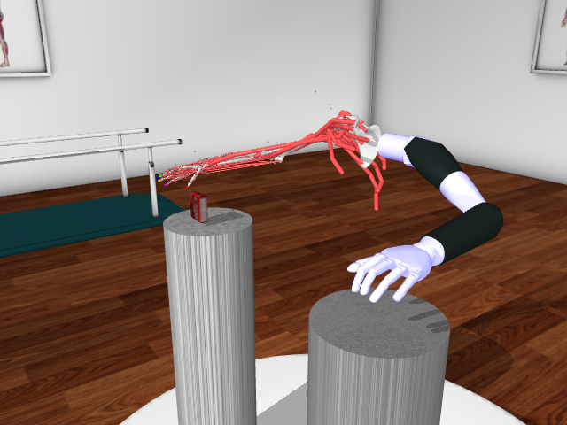

- **MSK model**: `myoarm_bionic_bimanual` — biological left arm+hand plus a
  prosthetic right arm, 73 bodies. Snapshot is the **reset frame** after an
  extra `mj_forward` (reset writes qpos after `mj_resetData` and leaves
  `xpos` stale until forwarded).
- **Task**: pick the object from the start pedestal with the biological hand
  and hand it to the prosthesis over the goal pedestal (`BimanualEnv`). Object
  scale/mass/friction are randomized.
- **Dims**: obs `(210,)`, action `(80,)`, `na=63`, `nu=80` (17 extra prosthetic
  actuators).
- **Backends**: CPU only.

---

# MyoChallenge 2026 — full-body chase-tag

## myoChallengeChaseTagFBVs-v0

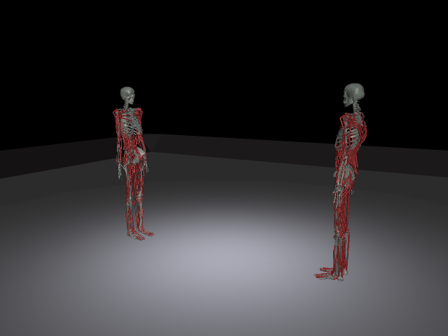

- **MSK model**: registers a MuscleMimic **full-body** model per agent (legs +
  torso + arms, 354 muscles/agent → `na=708`, `nu=708` total across both agents,
  203 bodies), via `chase_tag_vs_fullbody_model.py`. A myoLeg-only variant exists
  in code (`chase_tag_vs_model.py`, docstring: "same host model used by
  `LegWalkEnvV0`") but is **not** wired to this env_id — it backs the
  unregistered base `ChaseTagVsTaskConfig`, exercised directly by
  `myosuite/tests/test_chase_tag_registry.py`.
  - `myoChallengeChaseTagFBVs-v0` → `ChaseTagVsFullbodySteeredTaskConfig` (adds a
    live steering/gait-imitation reward term on top of the base full-body task,
    weight `w_steering=0.6`). This consolidates what were formerly two separate
    env_ids (`myoChallengeChaseTagVs-v0` and `myoChallengeChaseTagVsFullbody-v0`,
    the latter without the steering term) into one — the steered variant was
    kept, the unsteered base env_id was removed.
- **Task**: 1v1 self-play chase-tag — one agent is the chaser, one the runner
  (role sampled per episode); the chaser is rewarded for closing pelvis-to-pelvis
  distance and landing a tag (`ko_health_threshold` damage), the runner for
  evading (`myosuite/terms/multiplayer/chase_tag_vs_reward.py`).
- **Dims** (per agent, `Dict` obs/action space): obs `(546,)`, action `(354,)`.
- **Backends**: **CPU only** — no mjlab GPU registration was found for either
  env_id.
- **Status**: reset-pose bug (`ModularMultiAgentTaskEnv`'s `mj_resetData()` zeroing
  qpos with no keyframe fallback) fixed and committed this session.
  **Overlapping-spawn bug fixed**: both agents previously spawned at identical
  qpos (`a0_root`/`a1_root` at the same world position), because
  `two_agent_standing_qpos()` copied each agent's own single-agent standing
  keyframe verbatim — and free-joint qpos is an *absolute* world pose, so the
  per-agent `<frame>` translation/rotation `build_combined_spec` applies at
  the MJCF level had no effect once qpos overrode it. Fixed by threading a
  per-agent root offset (`default_root_offsets`, matching
  `build_combined_spec`'s existing placement convention: agent 0 at
  `[0, +separation_m/2, 0]`, agent 1 at `[0, -separation_m/2, 0]` rotated 180°
  about Z) through `two_agent_standing_qpos()`. The render above reflects the
  fix: the two agents are now separated by `config.agent_separation_m` (2 m)
  and facing each other.
  Separately, the tutorial `tutorials/11d_MuscleMimic_Fullbody_directional_locomotion.ipynb`
  documents a "single shared policy" data-collection pipeline for this task that
  has **no working checkpoint** — its data-collection cell is currently a stub.

---

## Regenerating snapshots

Default `env.render()` free cameras sit too far on arena/room models. These
renders use `mujoco.Renderer` + `MjvCamera`, geom groups 0–2, tendons on, and
`mj_forward` after reset. Dict action spaces need a dict of zeros.

**Legged/full-body characters are the reset frame (`mj_forward` only, no
stepping) — do not zero-action-settle them.** These models have no passive
muscle tone; even a handful of zero-action steps buckles the knees and
collapses the pelvis under gravity (confirmed: pelvis Z drops from 1.0 to
0.95 in just 10 steps on `myoLegWalk-v0`/`myoChallengeChaseTagP1-v0`), so a
30–60 step settle used to render characters lying on the floor instead of
standing. The reset keyframe is already a stable standing/task pose (running
stride for chase-tag/OSL, kick wind-up for soccer, etc.) — grab it directly.
Only the fixed-base elbow task (no free root, can't fall) still uses a short
zero-action settle with the default camera.

```bash
python3 - <<'PY'
import gymnasium as gym, numpy as np, mujoco, imageio.v2 as imageio
from myosuite import register_all_envs
register_all_envs()
env = gym.make("myoChallengeDieReorientP1-v0")
env.reset(seed=0)
mujoco.mj_forward(env.unwrapped.model, env.unwrapped.data)
# then MjvCamera + Renderer as below
PY
```

Manual cameras used here:

- Die / baoding: lookat on the `lunate` body (not a hardcoded world point —
  the hand sits at `~(-0.22, -0.44, 1.41)`, off-origin), distance `0.5`,
  azimuth `140`, elevation `-30` (reset frame).
- Relocate: lookat `(-0.08, -0.07, 1.20)`, distance `1.7`, azimuth `310`,
  elevation `-12` (reset frame). Framed from the front-right so the ribcage does
  not occlude the arm reaching to the object; the earlier tighter framing on the
  receptacle cropped the thorax out entirely.
- ChaseTag P1: lookat `(1.66, -1.7, 0.85)`, distance `5.0`, azimuth `40`,
  elevation `-10` (agent at origin, primitive opponent at `~(3.3, -3.4, 0)`).
- OSL run: lookat on pelvis `(-0.37, 15.0, 0.85)`, distance `2.4`, azimuth `110`,
  elevation `-8`.
- Soccer P1: lookat `(40.0, 0.0, 0.7)`, distance `5.5`, azimuth `110`,
  elevation `-8` (kicker pelvis `(39, 0, 0.92)`; tight enough to read the
  character while still showing the ball and pitch — the old `distance=14`
  framing on the far-away keeper shrank the kicker to a few pixels).
- Table tennis: lookat `S_grasp`, distance `1.6`, azimuth `60`, elevation
  `-30` (reset frame; 3/4 looking into the palm so the paddle face is visible
  — at elevation `-18` a palm-parallel blade is edge-on). Wider than the
  paddle-only framing used earlier — `distance=0.7` cropped the hand/wrist
  right out of frame and looked like an empty floor with a floating paddle;
  this framing keeps the torso and arm in view for context. The named
  `default` camera sits on the tabletop. **Reset frame only**.
- Bimanual: lookat `(0.0, -0.22, 1.22)`, distance `1.4`, azimuth `145`,
  elevation `-18`. Extra `mj_forward` after reset.
- ChaseTagVs: lookat on `a0_root`/`a1_root` with `distance≈2.5–6.0`.
