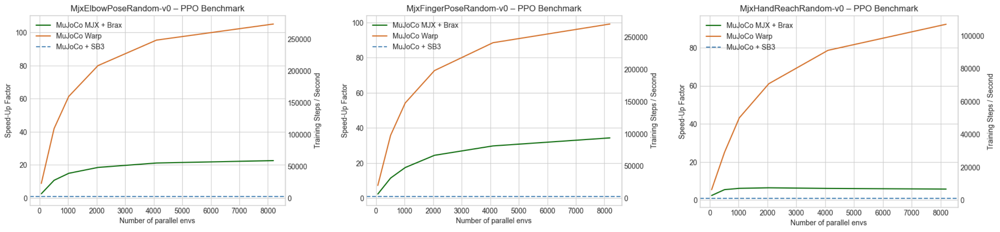
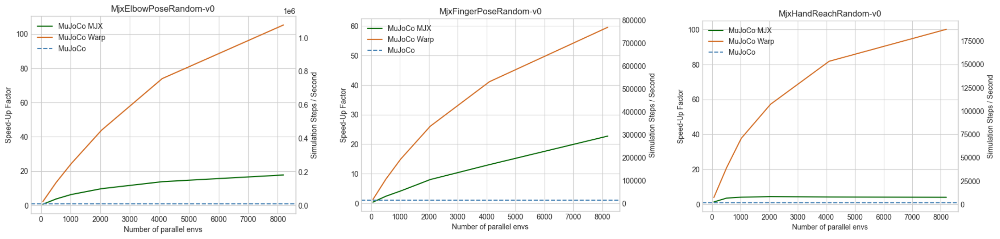

# MJX backend (experimental)

> [!NOTE] For most applications, we support using the mjlab implementations for GPU acceleration (`pip install -e ".[mjlab]"`, then`python scripts/train_mjlab.py <env_id>`). MJX is kept for usecases that need end-to-end JAX compilation or TPU compatibility.

This directory contains [MJX (MuJoCo XLA)](https://mujoco.readthedocs.io/en/stable/mjx.html) and [MJWarp](https://mujoco.readthedocs.io/en/latest/mjwarp/) implementations of MyoSuite environments for accelerated training.

# MyoSuite MJX and MJWarp


1. Switch to python 3.10 and install dependencies:
   ```bash
   # With uv:
   uv sync --extra mjx -p 3.10 # replace "mjx" with "mjx-cuda" for jax with cuda support

   # With pip:
   pip install -e ".[mjx]" # replace "mjx" with "mjx-cuda" for jax with cuda support
   ```

2. **Verify installation**:
   ```bash
   # remove uv run if you installed with pypi

   uv run python -c "import mujoco; print(f'MuJoCo version: {mujoco.__version__}')"
   uv run python -c "import jax; print(f'JAX devices: {jax.devices()}')"
   ```

Supported env ids (13; defined in `__init__.py` of this package). They use the `Mjx`
prefix and are not the `myo…` ids of the CPU and mjlab backends:

| Family | Ids |
|---|---|
| Pose | `MjxElbowPoseFixed-v0`, `MjxElbowPoseRandom-v0`, `MjxFingerPoseFixed-v0`, `MjxFingerPoseRandom-v0`, `MjxHandPoseRandom-v0` |
| Reach | `MjxHandReachFixed-v0`, `MjxHandReachRandom-v0`, `MjxFingerReachRandom-v0` |
| Walk | `MjxLegWalk-v0` (flat ground, mirrors `myoLegWalk-v0`) |
| Mimic | `MjxMimicBimanual-v0`, `MjxMimicFullbody-v0` (aliases `MjxMuscleMimicBimanual-v0`, `MjxMuscleMimicFullbody-v0`) |

There is no MJX version of the torso, arm, leg terrain/stand/directional envs or of the
`myoSarc…`/`myoFati…`/`myoReaf…` variants.


## Examples
Train JAX PPO with:
```bash
uv run train_jax_ppo.py --env_name=MjxElbowPoseRandom-v0 --impl=warp
```
Remember to initialize the submodules with `uv run myoapi_init` before running the examples (see the [main README](../../../../README.md) for more details).

### Benchmark Configuration

* **Environments:** MjxElbowPoseRandom-v0, MjxFingerPoseRandom-v0, and MjxHandReachRandom-v0, each trained for 5M total steps.
* **Algorithm:** PPO implemented in [Stable-Baselines3](https://github.com/DLR-RM/stable-baselines3) (MuJoCo) and [Brax](https://github.com/google/brax) (MJX, MJWarp).
  * Stable-Baselines3 params: n_steps=2048, batch_size=64, n_epochs=10.
  * BRAX params: unroll_length=10, batch_size=256, num_minibatches=32, num_updates_per_batch=8.
* **Hardware:** NVIDIA RTX 5090 GPU.

### Results

GPU-native vectorization (MJX, MJWarp) drastically reduces total training time compared to CPU-based parallelization (MuJoCo), enabling policies to be trained on myosuite environments in minutes rather than hours.



* **MJX** provides significant acceleration for MjxElbowPoseRandom-v0 and MjxFingerPoseRandom-v0, achieving up to **35x** speedup over MuJoCo. In MjxHandReachRandom-v0, however, MJX only shows 2-5x speedups over MuJoCo, likely due to greater contact complexity.
* **MuJoCo Warp**, which has been optimized to achieve improved scaling for contact-rich environments compared to MJX, consistently outperforms both MuJoCo and MJX across all environments, offering up to **100x** speedup over MuJoCo and another **5-20x** speedup over MJX, depending on the task environment and the number of parallel environments. With Warp, increasing the number of parallel environments consistenly improves training time for a fixed number of total steps.

## Simulation/Rollout Speed Benchmark

Similar effects can be observed for forward simulations (i.e. rollouts) in the respective environments, independent of the RL policy updates. The MuJoCo Warp physics engine can in principle run **150K to 1M** simulation steps per second, depending on the task environment and the number of parallel environments.



