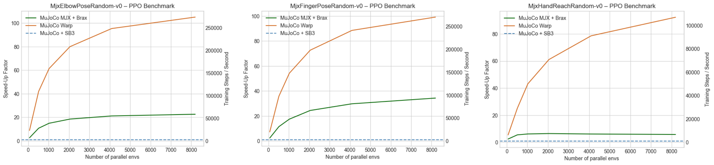
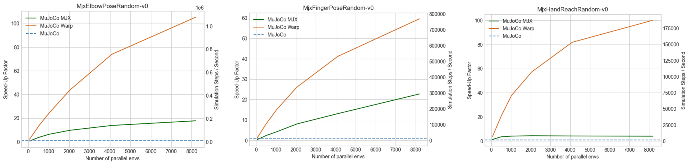

# MyoSuite MJX and MJWarp

This directory contains [MJX (MuJoCo XLA)](https://mujoco.readthedocs.io/en/stable/mjx.html) and [MJWarp](https://mujoco.readthedocs.io/en/latest/mjwarp/) implementations of MyoSuite environments for accelerated training.

## Installation

### Standard Installation
The default installation requires Python ≥3.10 and MuJoCo 3.5. See the [main README](../../../../README.md) for detailed installation instructions using uv, conda, or pip.

### Installation (Python ≥3.10, MuJoCo 3.5):

1. Switch to python 3.10 and install dependencies:
   ```bash
   # With uv:
   uv sync --extra mjx -p 3.10 # replace "mjx" with "mjx-cuda" for jax with cuda support

   # With pip:
   pip install -e ".[mjx]" # replace "mjx" with "mjx-cuda" for jax with cuda support
   ```

2. **Verify installation**:
   ```bash
   # remove uv run if you installed with pypi

   uv run python -c "import mujoco; print(f'MuJoCo version: {mujoco.__version__}')"
   uv run python -c "import jax; print(f'JAX devices: {jax.devices()}')"
   ```

## Examples
Train JAX PPO with:
```bash
uv run train_jax_ppo.py --env_name=MjxElbowPoseRandom-v0 --impl=warp
```
Remember to initialize the submodules with `uv run myoapi_init` before running the examples (see the [main README](../../../../README.md) for more details).

## Training Speed Benchmark

We train a PPO agent on three MyoSuite environments using [MuJoCo](../../../../benchmarks/mjx_benchmark_PPO_baseline.py), [MJX](../../../../benchmarks/mjx_benchmark_PPO.sh) and [MJWarp](../../../../benchmarks/mjx_benchmark_PPO.sh) and compare wall-clock training time.

### Benchmark Configuration

* **Environments:** MjxElbowPoseRandom-v0, MjxFingerPoseRandom-v0, and MjxHandReachRandom-v0, each trained for 5M total steps.
* **Algorithm:** PPO implemented in [Stable-Baselines3](https://github.com/DLR-RM/stable-baselines3) (MuJoCo) and [Brax](https://github.com/google/brax) (MJX, MJWarp).
  * Stable-Baselines3 params: n_steps=2048, batch_size=64, n_epochs=10.
  * BRAX params: unroll_length=10, batch_size=256, num_minibatches=32, num_updates_per_batch=8.
* **Hardware:** NVIDIA RTX 5090 GPU.
* **Training Scripts:** [MuJoCo](../../../../benchmarks/mjx_benchmark_PPO_baseline.py), [MJX & MJWarp](../../../../benchmarks/mjx_benchmark_PPO.sh)

### Results

GPU-native vectorization (MJX, MJWarp) drastically reduces total training time compared to CPU-based parallelization (MuJoCo), enabling policies to be trained on myosuite environments in minutes rather than hours.



* **MJX** provides significant acceleration for MjxElbowPoseRandom-v0 and MjxFingerPoseRandom-v0, achieving up to **35x** speedup over MuJoCo. In MjxHandReachRandom-v0, however, MJX only shows 2-5x speedups over MuJoCo, likely due to greater contact complexity.
* **MuJoCo Warp**, which has been optimized to achieve improved scaling for contact-rich environments compared to MJX, consistently outperforms both MuJoCo and MJX across all environments, offering up to **100x** speedup over MuJoCo and another **5-20x** speedup over MJX, depending on the task environment and the number of parallel environments. With Warp, increasing the number of parallel environments consistenly improves training time for a fixed number of total steps.

## Simulation/Rollout Speed Benchmark

Similar effects can be observed for forward simulations (i.e. rollouts) in the respective environments, independent of the RL policy updates. The MuJoCo Warp physics engine can in principle run **150K to 1M** simulation steps per second, depending on the task environment and the number of parallel environments. 

Simulation scripts can be found [here](../../../../benchmarks/mjx_benchmark_baseline.py) for MuJoCo and [here](../../../../benchmarks/mjx_benchmark.py) for MJX and MJWarp.


