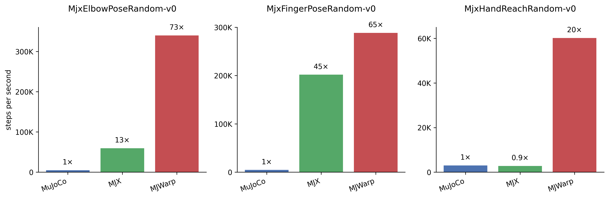

# MyoSuite MJX and MJWarp

This directory contains [MJX (MuJoCo XLA)](https://mujoco.readthedocs.io/en/stable/mjx.html) and [MJWarp](https://mujoco.readthedocs.io/en/latest/mjwarp/) implementations of MyoSuite environments for accelerated training.

## Installation

### Standard Installation
The default installation requires Python ≥3.9 and MuJoCo 3.3.6. See the [main README](../../../../README.md) for detailed installation instructions using uv, conda, or pip.

### Installation (Python ≥3.10, MuJoCo 3.5):

1. Switch to python 3.10 and install MJX dependencies:
   ```bash
   # With uv:
   uv sync --extra mjx -p 3.10 # replace "mjx" with "mjx-cuda" for jax with cuda support
   uv remove mujoco
   uv add "mujoco==3.3.6"
   uv add "mujoco-mjx==3.3.6" # use "mujoco-mjx[warp]" for warp support

   # With pip:
   pip install -e ".[mjx]" # replace "mjx" with "mjx-cuda" for jax with cuda support
   pip uninstall mujoco -y
   pip install "mujoco==3.3.6"
   pip install "mujoco-mjx==3.3.6" # use "mujoco-mjx[warp]" for warp support
   ```

   NOTE:
   - For [warp](https://github.com/google-deepmind/mujoco_warp) support, until it is integrated into the main mujoco release, you should depend on the warp tag: `mujoco-mjx[warp]`

2. **Verify installation**:
   ```bash
   # remove uv run if you installed with pypi

   uv run python -c "import mujoco; print(f'MuJoCo version: {mujoco.__version__}')"
   uv run python -c "import jax; print(f'JAX devices: {jax.devices()}')"
   ```

## Examples
Train JAX PPO with:
```bash
uv run train_jax_ppo.py --env_name=MjxElbowPoseRandom-v0 --impl=warp
```
Remember to initialize the submodules with `uv run myoapi_init` before running the examples (see the [main README](../../../../README.md) for more details).

## Training Speed Benchmark

We train a PPO agent on three MyoSuite environments using MuJoCo, MJX and MJWarp and compare wall-clock training time.

### Benchmark Configuration

* **Environments:** MjxElbowPoseRandom-v0, MjxFingerPoseRandom-v0, and MjxHandReachRandom-v0.
* **Algorithm:** PPO implemented in [Stable-Baselines3](https://github.com/DLR-RM/stable-baselines3) (MuJoCo) and [Brax](https://github.com/google/brax) (MJX, MJWarp).
  * Stable-Baselines3 params: n_steps=4096, batch_size=256, n_epochs=8. Environment interactions parallelized across 20 CPUs.
  * BRAX params: unroll_length=10, batch_size=256, num_minibatches=32, num_updates_per_batch=8.
* **Hardware:** NVIDIA RTX 4500 GPU.

### Results

GPU-native vectorization (MJX, MJWarp) drastically reduces total training time compared to CPU-based parallelization (MuJoCo), enabling policies to be trained on myosuite environments in minutes rather than hours.



* **MJX** provides significant acceleration for MjxElbowPoseRandom-v0 and MjxFingerPoseRandom-v0, achieving up to **45x** speedup over MuJoCo. MJX shows no benefit over MuJoCo in MjxHandReachRandom-v0, however, likely due to greater contact complexity.
* **MJWarp**, which has been optimized to achieve improved scaling for contact-rich environments compared to MJX, consistently outperforms both MuJoCo and MJX across all environments, offering a **20x–73x** speedup.
