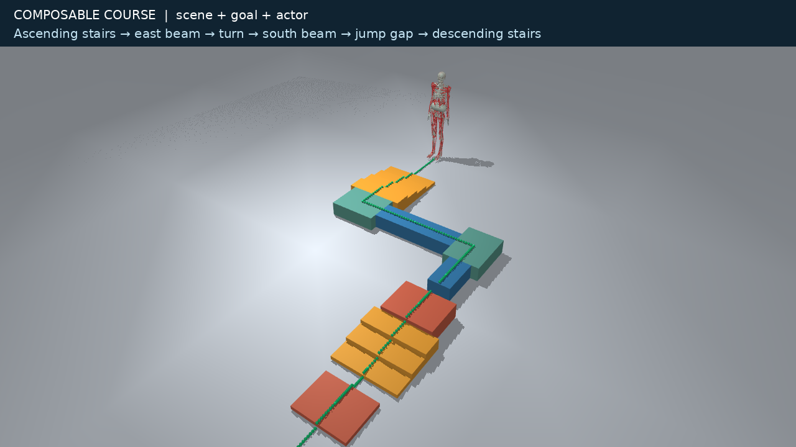
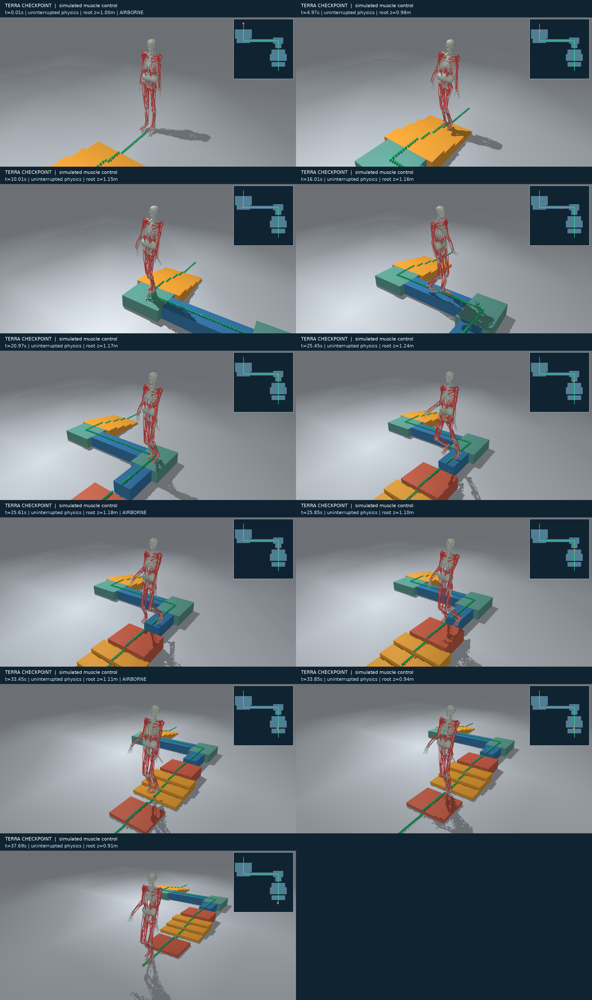

# Programmatic waypoint task: draft design and solution evidence

The notebook builds custom static terrain around a selected actor and runs an
ordered XY arrival task. The only new package module is
`myosuite/envs/waypoint.py`; model construction uses the existing
`ModelBuilder.from_spec(...).apply_transform(...)` API.

## Design choices

- **Scene + actor + goal:** callers build the MuJoCo model and pass it to
  `WaypointEnv(model, waypoints, body_name="pelvis", arrival_radius=.12)`.
  No second geometry schema, actor registry, scene editor or task-generation
  framework is introduced. A loop or `itertools.product` creates variants.
- **General scene authoring:** use MjSpec for boxes, rotations, meshes and other
  geometry. The notebook validates static stairs, beams and landing pads.
  Arbitrary geometry does not imply physical feasibility or controller support.
- **Small goal contract:** targets are world-frame XY points in metres, excluding
  spawn. The tracked body origin must be within the inclusive arrival radius;
  only the next target counts, at most once per control step. Repeated targets
  are permitted. Progress only changes in `step`, never when reading observations
  or rendering. Arrival is sampled, not swept between control steps.
- **Solver-independent:** observations contain physical state and the next goal;
  actions are raw actuator controls, clipped to declared control ranges. The
  reward is negative post-step distance to the previously active target, avoiding
  a reward jump caused by measuring the next target on an arrival step.
- **CPU first, draft status:** reuse MyoGymnasiumEnv stepping, rendering and reset
  conventions. Do not register an environment ID until there is a matching mjlab
  implementation and the cross-backend tests pass. No TaskConfig/ModularTaskEnv
  dependency and no changes to registered environments.
- **Bounded scope:** Gymnasium TimeLimit handles deadlines. This minimal class
  terminates on ordered completion or detected MuJoCo instability. It does not
  define fall, corridor, obstacle support, jump or energy criteria. A body could
  slide or fall into a target and satisfy XY arrival: extend the task before
  treating it as an obstacle-course benchmark. No TERRA weights, adapter,
  reference composer or training dependencies are bundled.

## Included evidence

[Watch/download the recorded TERRA course (MP4)](course-controlled.mp4).
The notebook also displays this movie.

The earlier local prototype used one released TERRA checkpoint to drive 354
muscle actuators through an 8.5 m route in 37.93 s, without simulation resets or
state overwrites during control. Rendering replays its recorded physical poses.
It completed all nine targets on four 6 cm ascending steps, two 36 cm beams,
two right-angle turns, a 24 cm descent and two 20 cm gaps.
The independent contact check measured 0.12 s and 0.19 s airborne, correct
launch/landing surfaces and recovered bilateral support. There were no floor
contacts during beam traversal. See `verification-seed-0.json`.

This evidence is **one tuned course and one stochastic seed**, produced after
eight reference-planner iterations. It is not an evaluation of arbitrary paths,
a success-rate estimate, a fresh rollout of this PR's minimal class, or a claim
of biomechanical validity. The earlier evaluator additionally enforced a 35 cm
path corridor, a fall criterion and post-rollout contact checks. `course.json`
records that earlier scene/goal/actor specification; its route includes the
start point, while the new API takes targets only.

The notebook deliberately uses the native packaged `myo_sim` actor. The recorded
TERRA solution used its exact saved actor contract (different model version,
calibration and contact settings); do not load that checkpoint onto the native
actor without a validated adapter. The notebook's live positive-control example
uses a small planar motor-driven actor, and its MyoFullBody example is only a
finite-state zero-control smoke test.

Provenance in `versions.json`:

- TERRA: <https://github.com/amathislab/terra>, commit
  `db9d0d694f776c9de56b8cb3fc3ab48804bd57a1`.
- Checkpoint: <https://huggingface.co/merc-s/TERRA-4B>, `checkpoint_24416`, revision
  `b89a604d0687549f2678bb1b6a436dea058cd8b9` (weights excluded).
- MyoSuite base: `ccb4fc4cb2fd6a92aac94bdc5081c13d94bc42b8`.

The scene geometry, JSON and rendered media were generated in this project.
Upstream code and checkpoint weights are not redistributed here. Exact solver
reproduction requires the separate earlier prototype and its dependencies; the
notebook reproduces scene construction, goal evaluation and the planar example.

## Before promotion from draft

Add a matched mjlab task using shared goal terms, test observation/action/timing
parity, and define configurable physical failure/contact criteria. Integrate
TERRA as an optional solution only after validating its actor and observation
contract. Freeze the composer and evaluate held-out generated courses before
claiming general path following.
